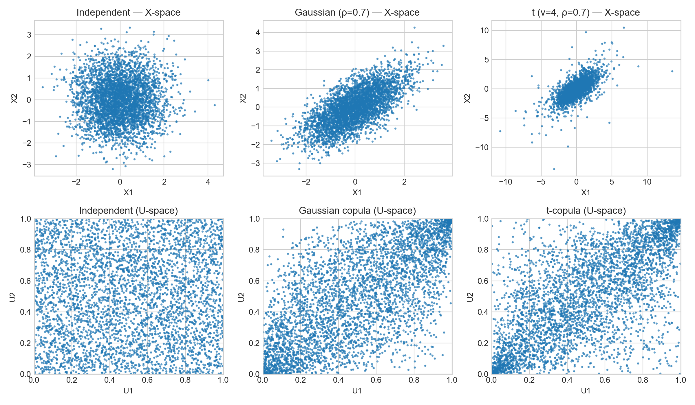
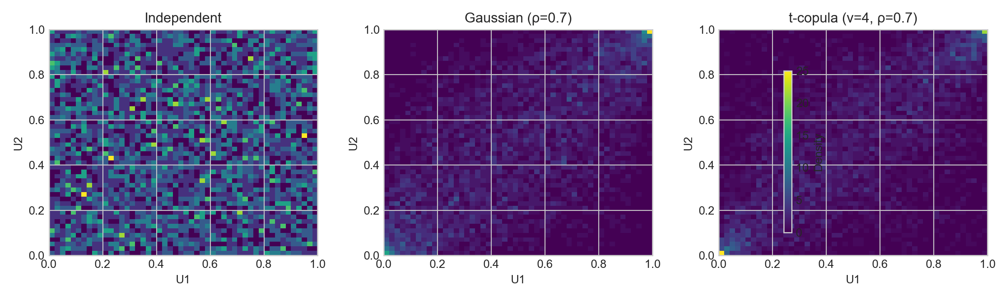
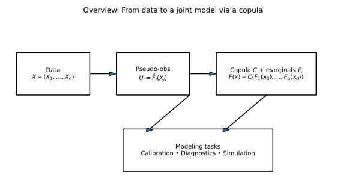

# 1. What Is a Copula?

## 1.1 Context and Motivation

In multivariate statistics and risk modeling, we often need to describe **dependence** among random variables **separately** from their marginal behaviors.  
A **copula** provides precisely that mechanism — it links univariate distributions into a joint model while isolating the dependence structure.

This decoupling is essential in finance and risk:
- Marginals can exhibit **heavy tails** or **skewness**.
- Dependence can be **nonlinear**, **asymmetric**, or **tail-focused**.
- Linear correlation fails to capture such complex co-movements.

Copulas therefore allow flexible and realistic dependence modeling, beyond the limitations of Pearson’s correlation.

---

## 1.2 Mathematical Definition

A **copula** is a multivariate cumulative distribution function (CDF) on $[0,1]^d$ with **uniform marginals**. Formally,

$$
C:[0,1]^d \to [0,1], \qquad
C(u_1,\ldots,u_d) = \Pr(U_1 \le u_1,\ldots,U_d \le u_d),
$$

where each $U_i \sim \mathcal{U}(0,1)$.

Given a random vector $X=(X_1,\ldots,X_d)$ with marginals
$F_i(x)=\Pr[X_i\le x]$, **Sklar’s theorem** ensures the existence of a copula $C$ such that

$$
F(x_1,\ldots,x_d)
  = C\!\big(F_1(x_1),\ldots,F_d(x_d)\big).
\tag{1}
$$

If $F_i$ are continuous, $C$ is unique. Conversely, any choice of valid marginals $F_i$ and a copula $C$ defines a legitimate joint distribution.

---

## 1.3 Why Copulas Matter in Risk Modeling

**Limitations of linear correlation:**
- Captures only *linear* association.
- Ignores *tail asymmetry* and *extreme co-movements*.
- May remain stable in the mean while breaking down in the tails.

**Advantages of copulas:**
- Decouple marginals and dependence.
- Capture nonlinear, asymmetric, and tail dependence.
- Allow heterogeneous marginals (e.g., lognormal + Pareto).
- Enable simulation of realistic joint extremes.

**Typical applications:**
- Portfolio and credit risk aggregation.  
- Joint default modeling and co-exceedance analysis.  
- Stress testing and scenario generation.  
- Operational-risk dependence across business lines.

---

## 1.4 Geometric Intuition: The U-Space

Each component is transformed to its *probability scale*:

$$
U_i = F_i(X_i) \in [0,1].
$$

In this **U-space**, marginal shapes and scales disappear; what remains is pure dependence.  
- Independence → uniform scatter.  
- Positive dependence → mass along the diagonal.  
- Tail dependence → density near corners (e.g., $(0,0)$ or $(1,1)$).

This makes U-space plots and diagnostics central in copula calibration.

---

## 1.5 Key Properties

1. **Uniform marginals:** $C(u_1,\ldots,1,\ldots,u_d)=u_i$.  
2. **Groundedness:** $C(u_1,\ldots,u_d)=0$ if any $u_i=0$.  
3. **$d$-increasing:** ensures non-negative probability volumes.  
4. **Invariance under monotone transforms:** rank-based measures depend only on $C$.  
5. **Density factorization (if continuous):**
   $$
   f_X(x)
   = c\!\big(F_1(x_1),\ldots,F_d(x_d)\big)
     \prod_{i=1}^d f_i(x_i),
   $$
where $c = \partial^d C / (\partial u_1 \cdots \partial u_d)$.

---

## 1.6 Practical Modeling Pipeline

**Input → Marginals → Copula → Diagnostics → Simulation**

1. Specify and fit each marginal $F_i$ (parametric, semi-parametric, or empirical).  
2. Transform data: $U_i = \hat F_i(X_i)$.  
3. Choose a copula family (Gaussian, t, Archimedean, Vine, etc.).  
4. Estimate parameters:
   - **IFM** (Inference Functions for Margins): estimate $F_i$ then $C$.
   - **Pseudo-MLE**: replace $F_i$ by $\hat F_i$ directly.
5. Diagnose fit using U-space plots, Kendall plots, and goodness-of-fit tests.  
6. Use the model for simulation, stress testing, or portfolio aggregation.

---

## 1.7 Correlation vs. Copula

| Aspect | Pearson Correlation (ρ) | Copula |
|--------|-------------------------|--------|
| Nature | Linear moment measure | Full dependence function |
| Marginals | Affects value of ρ | Invariant to monotone transforms |
| Tail behavior | Not captured | Explicit (λL, λU) |
| Asymmetry | No | Yes (e.g., Clayton vs. Gumbel) |
| Dimensionality | Simple | Scalable via Vine structures |

---

## 1.8 Common Copula Families

- **Gaussian:** symmetric, no tail dependence ($\lambda=0$).  
- **Student-t:** symmetric, positive tail dependence ($\lambda>0$), controlled by degrees of freedom $\nu$.  
- **Archimedean (Clayton, Gumbel, Frank):** asymmetric, flexible, simple calibration via Kendall’s $\tau$.  

---

## 1.9 Illustrations

**Figure 1:** *From data space to U-space*  

**Figure 2:** *Heatmaps of copula density*  

**Figure 3:** *Conceptual pipeline (annotated)*  

---

## 1.10 Good Modeling Practice

- Validate each marginal first — copulas cannot fix bad marginals.  
- Work primarily in U-space for diagnostics.  
- Use $\tau$-inversion for initialization.  
- Check asymmetry of upper/lower tails.  
- For high dimensions, use Vine copulas.  
- Validate out-of-sample tail risk metrics.

---

## 1.11 References

- Nelsen, R. B. (2006). *An Introduction to Copulas*, 2nd ed. Springer.  
- Joe, H. (2014). *Dependence Modeling with Copulas*. CRC Press.  
- McNeil, A. J., Frey, R., & Embrechts, P. (2015). *Quantitative Risk Management*. Princeton University Press.