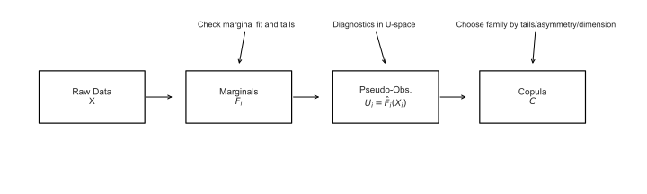

# 1. What is a Copula?

## 1.1 Context and Motivation

In multivariate statistics and risk modeling, it is often necessary to
describe dependence among random variables *separately* from their
individual marginal behaviors.  
A **copula** provides precisely that mechanism: it links univariate
distributions into a joint model while isolating the dependence
structure.  
This separation enables flexibility — one may combine heavy-tailed or
skewed marginals with an appropriate dependence pattern.

---

## 1.2 Mathematical Definition

A **copula** is a cumulative distribution function (CDF) on
$[0,1]^d$ with **uniform marginals**. Formally,

$$
C:[0,1]^d \to [0,1], \qquad
C(u_1,\ldots,u_d) = \Pr(U_1 \le u_1, \ldots, U_d \le u_d),
$$

where each $U_i \sim \mathcal{U}(0,1)$.

Given a random vector $X=(X_1,\dots,X_d)$ with marginals
$F_i(x)=\Pr[X_i\le x]$, Sklar’s theorem guarantees the existence of
a copula $C$ such that

$$
F(x_1,\dots,x_d)
  = C\!\big(F_1(x_1),\dots,F_d(x_d)\big).
\tag{1}
$$

If $F_i$ are continuous, $C$ is unique. Conversely, any choice of
valid univariate $F_i$ and a copula $C$ defines a legitimate joint CDF.

---

## 1.3 Interpretation and Intuition

Equation (1) expresses the joint CDF as a **composition**:
marginals describe univariate behavior, and the copula “stitches” them
together.  
In practical modeling, we replace each $X_i$ by its empirical CDF
$\hat F_i(X_i)$ to obtain pseudo-observations
$U_i=\hat F_i(X_i)\in[0,1]$, on which the copula is calibrated.

This construction enables tasks such as:
- Modeling nonlinear and asymmetric dependence.
- Combining heterogeneous marginal models (e.g. lognormal + Pareto).
- Capturing joint tail behavior separately from individual tails.

---

## 1.4 Properties and Remarks

1. **Uniform marginals:** $C(u_1,\dots,1,\dots,u_d)=u_i$.
2. **Groundedness:** $C(u_1,\dots,u_d)=0$ if any $u_i=0$.
3. **$d$-increasing:** ensures non-negativity of the corresponding density.
4. **Invariance under monotone transforms** — dependence measured by
   ranks depends only on $C$.

---

## 1.5 Illustration

The figure below summarizes the complete conceptual pipeline.

**Figure:** *Overview: From data to a joint model via a copula*  

This diagram shows how raw data are transformed through empirical
marginals ($F_i$) into pseudo-observations $U_i$, then linked by a
copula $C$ to build the joint model $F$ and enable calibration,
diagnostics and simulation.

---

## 1.6 References

- Nelsen, R. B. (2006). *An Introduction to Copulas*, 2nd ed., Springer.  
- Joe, H. (2014). *Dependence Modeling with Copulas*, CRC Press.  
- McNeil, A. J., Frey, R., & Embrechts, P. (2015).
  *Quantitative Risk Management*, Princeton University Press.

