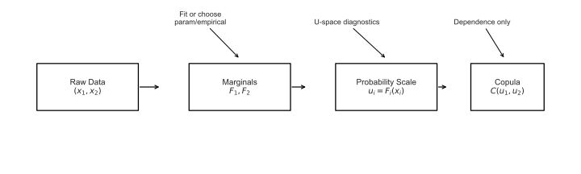
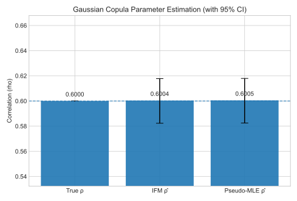
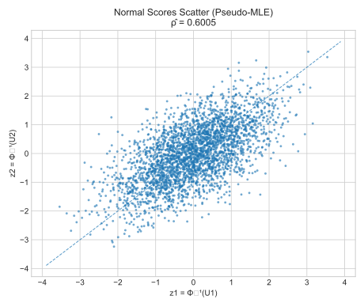
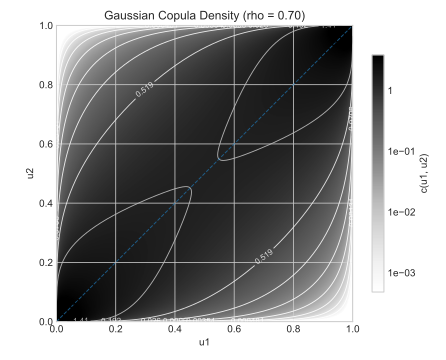

# 2. Sklar’s Theorem

## 2.1 Context and Motivation

Sklar’s theorem (1959) formalizes the separation between **marginals** and **dependence**.  
It states that any multivariate CDF can be expressed as a **composition** of its univariate marginals and a **copula** that carries all the dependence information.

This is the foundational result that enables copula-based modeling of complex joint behavior with flexible marginals.

---

## 2.2 Statement

Let $F$ be a 2-dimensional CDF with marginals $F_1, F_2$. Then there exists a copula $C$ such that
$$
F(x_1,x_2) = C\!\big(F_1(x_1), F_2(x_2)\big).
\tag{2}
$$

If $F_1, F_2$ are continuous, $C$ is unique. Conversely, for any copula $C$ and any valid univariate CDFs $F_1, F_2$, the composition (2) defines a legitimate bivariate CDF.

If densities exist, the factorization reads
$$
f_X(x_1,x_2)
  = c\!\big(F_1(x_1), F_2(x_2)\big)\, f_1(x_1)\, f_2(x_2),
\tag{3}
$$
where $c = \partial^2 C / (\partial u_1 \partial u_2)$ is the copula density.

  
**Figure 1.** Functional composition illustrating $F(x)=C(F_1,F_2)$.

---

## 2.3 Interpretation and Practical Inference

Equation (3) shows that **dependence enters only through $c$**. This leads to two standard estimation routes:

- **IFM (Inference Functions for Margins).**  
  1) Fit each marginal $F_i$ (parametric/empirical).  
  2) Transform: $u_i = \hat F_i(x_i)$.  
  3) Estimate copula parameters from the $u$’s (e.g., MLE).

- **Pseudo-MLE.**  
  Replace $F_i$ by empirical CDFs directly: $u_i = \hat F^{\text{emp}}_i(x_i)$, then maximize the copula likelihood.

For a **Gaussian copula**, $\hat\rho$ under pseudo-MLE equals the sample correlation of normal scores $z_i = \Phi^{-1}(u_i)$.

  
**Figure 2a.** Comparison of $\rho$ estimates via IFM and pseudo-MLE with 95% confidence intervals.

  
**Figure 2b.** Diagnostic scatter of normal scores under the pseudo-MLE approach.

---

## 2.4 Factorization Intuition

The copula density $c(u_1,u_2)$ reweights the product of marginals $f_1 f_2$ to produce the joint density $f_X$.  
For a Gaussian copula with correlation $\rho$, the copula density is
$$
c(u_1,u_2;\rho)
= \frac{\phi_2\big(\Phi^{-1}(u_1), \Phi^{-1}(u_2);\rho\big)}
       {\phi\big(\Phi^{-1}(u_1)\big)\,\phi\big(\Phi^{-1}(u_2)\big)},
$$
where $\phi_2$ is the bivariate normal density and $\phi$ is the univariate normal density.

  
**Figure 3.** Heatmap of $c(u_1,u_2;\rho)$ for $\rho=0.7$, showing diagonal concentration under positive correlation.

---

## 2.5 Discrete Marginals and Non-Uniqueness

If the marginals are **not** continuous, the copula in (2) may **not be unique**.  
In practice, with mixed/discrete data, one can work with **pseudo-observations** via average ranks, or adopt **latent variable** formulations (e.g., Gaussian copulas with threshold models) to restore identifiability.

---

## 2.6 References

- Sklar, A. (1959). *Fonctions de répartition à n dimensions...*  
- Nelsen, R. B. (2006). *An Introduction to Copulas*, 2nd ed., Springer.  
- Joe, H. (2014). *Dependence Modeling with Copulas*, CRC Press.  
- McNeil, A. J., Frey, R., & Embrechts, P. (2015). *Quantitative Risk Management*, Princeton Univ.
