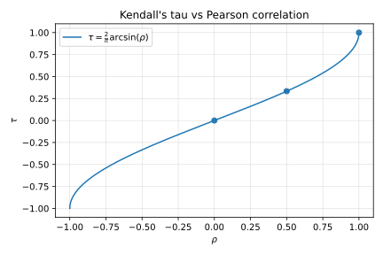

# 3. Rank-Based Dependence Measures

## 3.1 Context

Linear correlation $\rho$ captures only monotonic linear association.
Copulas allow *nonlinear* dependence; rank-based measures such as
Spearman’s $\rho_s$ and Kendall’s $\tau$ are copula-invariant.

---

## 3.2 Definitions

- **Spearman’s rho**
  $$
  \rho_s = \rho\!\big(F_1(X_1),F_2(X_2)\big).
  \tag{4}
  $$

- **Kendall’s tau**
  $$
  \tau = \mathbb{E}\!\left[
    \operatorname{sign}\!\big((X_1-\tilde X_1)(X_2-\tilde X_2)\big)
  \right].
  \tag{5}
  $$

For elliptical families (including the Gaussian copula),
there exists the analytical relation:

$$
\tau = \frac{2}{\pi}\arcsin(\rho).
\tag{6}
$$

---

## 3.3 Interpretation

- $\tau$ measures the probability of concordance minus discordance.  
- Both $\tau$ and $\rho_s$ are invariant under monotone transforms.  
- They provide robust estimators under heavy tails and are often used
  for parameter initialization (“$\tau$-inversion”).

---

## 3.4 Illustration

**Figure:** *Kendall’s τ vs Pearson ρ*  

The analytic curve (6) shows a monotonic increase of τ with ρ,
demonstrating their one-to-one mapping in elliptical copulas.
The notebook confirms it empirically with Gaussian samples.

---

## 3.5 References

- Nelsen (2006), Ch. 5.  
- Joe (2014), §5.2.  
- Haugh (M.), *An Introduction to Copulas*, Columbia Univ.
