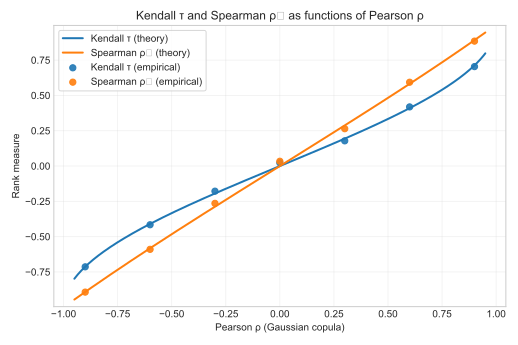

# 3. Rank Measures

## 3.1 Intuition

Rank-based measures summarize **monotone association** and are **invariant** to strictly monotone transformations of the marginals.  
They therefore depend **only on the copula** and not on the univariate shapes or scales.  
Intuitively, they count how often pairs of observations move **in the same relative direction** (concordant) versus **opposite** (discordant).

---

## 3.2 Kendall’s $\tau$

### Definition (population)
Kendall’s $\tau$ is the difference between the probabilities of concordance and discordance:
$$
\tau = \Pr\big[(X_1-X_1')(X_2-X_2') > 0\big] \;-\; \Pr\big[(X_1-X_1')(X_2-X_2') < 0\big].
$$
In terms of the copula $C$, for continuous marginals,
$$
\tau = 4 \int_{[0,1]^2} C(u_1,u_2) \, dC(u_1,u_2) - 1.
$$

### Empirical estimator
Given data $\{(x_{1i},x_{2i})\}_{i=1}^n$, Kendall’s $\hat\tau$ can be computed via pair counting or
directly with standard routines. In practice we work in $U$-space using pseudo-observations $u_{ji}=\hat F_j(x_{ji})$.

```python
from scipy.stats import kendalltau
tau_hat = kendalltau(U[:,0], U[:,1])[0]
```

---

## 3.3 Spearman’s $\rho_s$

### Definition (population)
Spearman’s $\rho_s$ is the Pearson correlation of the probability-scale variables:
$$
\rho_s = \mathrm{Corr}(U_1, U_2), \quad U_j = F_j(X_j).
$$
Equivalently,
$$
\rho_s = 12 \int_{[0,1]^2} \big(u_1 - \tfrac12\big)\big(u_2 - \tfrac12\big) \, dC(u_1,u_2).
$$

### Empirical estimator
With pseudo-observations $U$:
```python
from scipy.stats import spearmanr
rho_s_hat = spearmanr(U[:,0], U[:,1])[0]
```

---

## 3.4 Relationship with Copulas (Gaussian case)

For the **Gaussian copula** with Pearson correlation $\rho$:
$$
\tau(\rho) = \frac{2}{\pi}\arcsin(\rho), \qquad
\rho_s(\rho) = \frac{6}{\pi}\arcsin\!\big(\tfrac{\rho}{2}\big).
$$

  
**Figure 1.** Theoretical $\tau(\rho)$ and $\rho_s(\rho)$ with empirical validation points.

---

## 3.5 Visual Diagnostics

Scatter plots in $U$-space emphasize that rank measures depend only on the copula.  
Below, Gaussian copulas with increasing $\rho$:


**Figure 2.** U-space scatter with empirical Kendall’s $\tau$ and Spearman’s $\rho_s$ shown in titles.

---

## 3.6 Practical Use: $\tau$-Inversion

For several copula families, parameters can be recovered from $\tau$:

| Family (parameter) | $\tau$ relation | Inversion $\theta(\tau)$ |
|---|---|---|
| **Clayton** $(\theta>0)$ | $\tau = \tfrac{\theta}{\theta+2}$ | $\theta = \tfrac{2\tau}{1-\tau}$ |
| **Gumbel** $(\theta\ge 1)$ | $\tau = 1 - \tfrac{1}{\theta}$ | $\theta = \tfrac{1}{1-\tau}$ |
| **Frank** $(\theta\ne 0)$ | no closed-form; numerical via Debye function $D_1$ | solve $\tau(\theta)$ numerically |
| **Gaussian** $(-1<\rho<1)$ | $\tau = \tfrac{2}{\pi}\arcsin(\rho)$ | $\rho = \sin\!\big(\tfrac{\pi}{2}\tau\big)$ |
| **t (ν fixed)** | same as Gaussian for $\rho$ | $\rho = \sin\!\big(\tfrac{\pi}{2}\tau\big)$ |

These formulas are useful for **initialization** prior to MLE or for quick calibration when data are scarce.

---

## 3.7 References

- Nelsen, R. B. (2006). *An Introduction to Copulas*, 2nd ed., Springer.  
- Joe, H. (2014). *Dependence Modeling with Copulas*, CRC Press.  
- McNeil, A. J., Frey, R., & Embrechts, P. (2015). *Quantitative Risk Management*, Princeton University Press.