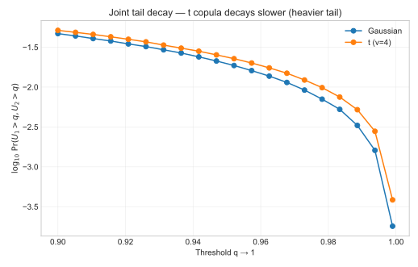
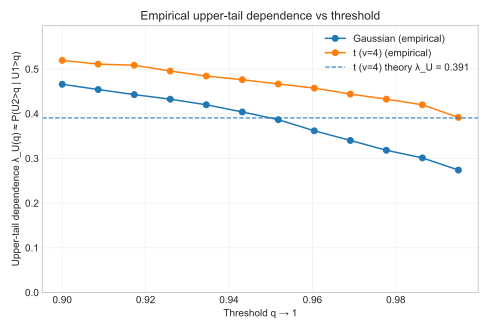
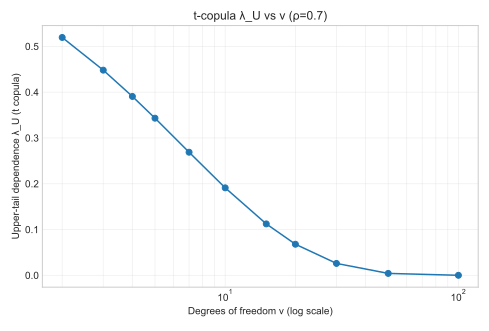

# 4. Tail Dependence

## 4.1 Intuition

**Tail dependence** measures how likely two variables are to be *simultaneously extreme*.  
Rank-based correlation can be moderate while extremes co-move strongly — a phenomenon that copulas can capture explicitly.

---

## 4.2 Definitions

For a bivariate copula $C$ with uniform margins $U_1,U_2\sim\mathcal U(0,1)$:

- **Upper-tail dependence**:
  $$
  \lambda_U := \lim_{q\uparrow 1}\Pr\!\big(U_2 > q \,\big|\, U_1 > q\big).
  $$
- **Lower-tail dependence**:
  $$
  \lambda_L := \lim_{q\downarrow 0}\Pr\!\big(U_2 \le q \,\big|\, U_1 \le q\big).
  $$

Interpretation: $\lambda_U$ (resp. $\lambda_L$) is the asymptotic conditional probability of a co-exceedance in the upper (resp. lower) tail.

---

## 4.3 Examples

- **Gaussian copula**: $\lambda_U = \lambda_L = 0$ for $-1<\rho<1$.  
- **t copula** (symmetric tails): for correlation $\rho$ and degrees of freedom $\nu$,
  $$
  \lambda_U = \lambda_L
  = 2\,t_{\nu+1}\!\Big(-\sqrt{\tfrac{(\nu+1)(1-\rho)}{1+\rho}}\Big),
  $$
  where $t_{\nu+1}$ is the CDF of a Student-$t$ with $\nu+1$ degrees of freedom.
  As $\nu\to\infty$, $\lambda_U\to0$ (Gaussian limit).

**Figure 1** contrasts the **upper-right corner** of $U$-space for Gaussian vs t copulas.

---

## 4.4 Empirical Estimation

A practical estimator for upper tails is
$$
\hat\lambda_U(q) \,=\, \frac{\#\{i: U_{1i}>q,\; U_{2i}>q\}}{\#\{i: U_{1i}>q\}},
\qquad q\uparrow1.
$$

Compute it on a grid of high thresholds $q\in[0.9,0.995]$ and inspect stability as $q\to1$.  
**Figure 2** shows $\hat\lambda_U(q)$ for Gaussian vs t copulas, with the **theoretical** $\lambda_U$ (t) as a reference.

---

## 4.5 Sensitivity to Degrees of Freedom (t Copula)

Tail dependence in the t copula is governed by $\nu$: smaller $\nu$ implies **heavier** tails and larger $\lambda_U$.  
**Figure 3** plots the closed-form $\lambda_U$ against $\nu$ (log scale) for fixed $\rho=0.7$.

---

## 4.6 Practical Notes

- Even with similar Kendall’s $\tau$, models can have **very different tail risks**. Always check $\lambda_U,\lambda_L$.  
- Use large samples or block-bootstrap to stabilize tail estimates.  
- For asymmetric tails (e.g., **Clayton**: lower-tail; **Gumbel**: upper-tail), inspect both corners.  
- In credit/operational risk, $\lambda_U$ drives **joint-default** and **co-loss** probabilities in stress.  
- In market risk, t copulas can replicate **crisis clustering** that Gaussian copulas miss.

---

## 4.7 References

- Nelsen, R. B. (2006). *An Introduction to Copulas*, 2nd ed., Springer.  
- Joe, H. (2014). *Dependence Modeling with Copulas*, CRC Press.  
- McNeil, A. J., Frey, R., & Embrechts, P. (2015). *Quantitative Risk Management*, Princeton University Press.