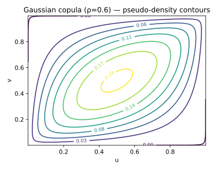

## 1.1 Context and Motivation
The **Gaussian copula** is the most classical member of the elliptical
family of copulas. It provides a mathematically elegant way to describe
dependence between random variables while preserving analytical
tractability.

Historically, its use expanded widely in quantitative finance and risk
management due to its simplicity and the convenient properties of the
multivariate normal distribution. In a Gaussian copula, the entire
dependence structure is encoded in a **correlation matrix**, making it a
natural extension of linear correlation to a multivariate probabilistic
framework.

However, this simplicity comes at a cost: although it reproduces
correlation and concordance measures accurately, it fails to capture
**joint tail events** (asymptotic independence), which is a crucial
limitation in fields such as credit risk modeling and systemic risk
analysis.

---

## 1.2 Mathematical Definition

Let $\Sigma$ be a symmetric positive-definite correlation matrix with
$\Sigma_{ii}=1$ and $\Sigma_{ij}=\rho_{ij}$ for $i\neq j$.
The **Gaussian copula** $C_\Sigma:[0,1]^d\rightarrow[0,1]$ is defined as

$$
C_\Sigma(u_1,\ldots,u_d)
 = \Phi_\Sigma\!\big(\Phi^{-1}(u_1),\ldots,\Phi^{-1}(u_d)\big),
$$

where:
- $\Phi_\Sigma$ denotes the joint CDF of a $d$-dimensional standard
  normal vector with correlation $\Sigma$,
- $\Phi^{-1}$ is the univariate inverse normal CDF (the probit
  function).

The corresponding **density** is obtained via the Jacobian of the
probability integral transform:

$$
c_\Sigma(u_1,\ldots,u_d)
  = \frac{\phi_\Sigma(z_1,\ldots,z_d)}
          {\prod_{i=1}^d \phi(z_i)}, \quad
  z_i = \Phi^{-1}(u_i),
$$

where $\phi_\Sigma$ and $\phi$ are the multivariate and univariate
standard normal densities, respectively.

In the bivariate case $(d=2)$, this simplifies to

$$
c_\rho(u,v)
 = \frac{1}{\sqrt{1-\rho^2}}
   \exp\!\left(
     -\frac{\rho^2(z_1^2+z_2^2)-2\rho z_1 z_2}{2(1-\rho^2)}
   \right),
$$
with $z_i = \Phi^{-1}(u_i)$ and $-1 < \rho < 1$.

---

## 1.3 Interpretation and Intuition

The Gaussian copula represents **dependence through linear correlation**
on the latent normal scale. Intuitively, we assume that each variable
$X_i$ arises from an underlying latent normal variable $Z_i$, and then
transform $Z_i$ through its marginal distribution $F_i$:

$$
U_i = \Phi(Z_i), \qquad X_i = F_i^{-1}(U_i).
$$

The correlation between $Z_i$ and $Z_j$ determines the strength and sign
of dependence between $X_i$ and $X_j$.  
However, once transformed through nonlinear marginal functions, the
relationship between the observed variables becomes **nonlinear but
monotonic**.

From a geometrical point of view, the contours of the Gaussian copula
density are **ellipses** on the $(z_1,z_2)$ plane, mapped to the unit
square $(u_1,u_2)$. As $\rho$ increases, the copula mass shifts towards
the diagonals (positive correlation) or anti-diagonals (negative).

This symmetric shape implies that upper and lower tails are treated
identically and decay at the same exponential rate, hence the absence of
tail dependence.

---

## 1.4 Properties and Remarks

| Property | Expression / Description | Implication |
|-----------|--------------------------|--------------|
| **Domain** | $[0,1]^d$ | Defined on the unit hypercube |
| **Symmetry** | $C_\Sigma(u)=C_\Sigma(1-u)$ | Elliptical symmetry |
| **Tail dependence** | $\lambda_U=\lambda_L=0$ | Asymptotic independence |
| **Kendall’s τ** | $\tau = \tfrac{2}{\pi}\arcsin(\rho)$ | Analytical mapping |
| **Spearman’s ρ** | $\rho_s = \tfrac{6}{\pi}\arcsin(\tfrac{\rho}{2})$ | Analytical mapping |
| **Copula density** | $c_\Sigma(u)=\phi_\Sigma(z)/\prod\phi(z_i)$ | Analytical form |
| **Simulation** | 1. Simulate $Z\sim N(0,\Sigma)$ 2. Return $U_i=\Phi(Z_i)$ | Very efficient |
| **Limit** | $\rho\to0 \Rightarrow$ independence copula | $C(u,v)=uv$ |
| **Limit** | $\rho\to\pm1 \Rightarrow$ comonotonic / countermonotonic | Perfect correlation |

<!-- Added -->
**Note:** For elliptical copulas such as the Gaussian, rank-based dependence measures like **Kendall’s τ** and **Spearman’s ρ** depend *only* on the latent correlation parameter ρ.  
This invariance arises because monotonic transformations of the marginals do not alter the dependence on the latent normal scale — hence these measures are entirely determined by Σ.

---

## 1.5 Illustration

**Figure — Gaussian copula density contours (ρ=0.6)**  

This figure shows the smooth elliptical contours of the bivariate
Gaussian copula.  
The density peaks along the main diagonal as $\rho$ increases,
indicating strong positive dependence.  
Note that near the corners $(0,0)$ and $(1,1)$, the density flattens
rapidly — the copula does not exhibit concentration of probability mass
in the tails.

**Figure — Simulated pseudo-observations**  

Samples $(u_1,u_2)$ drawn from the Gaussian copula with $\rho=0.6$
illustrate symmetric dependence and the absence of extreme clustering.

<!-- Added -->
**Asymptotic independence insight:**  
The Gaussian copula exhibits *asymptotic independence* in both tails, since for large quantiles $q\to1$ the joint survival probability behaves as  
$\Pr(U_1>q,\,U_2>q) \sim (1-q)\,\frac{\exp\!\big(-\tfrac{1}{1+\rho}\Phi^{-1}(q)^2\big)}{\sqrt{1-\rho^2}}$.  
The exponential decay implies $\lambda_U=\lambda_L=0$, confirming that the model cannot reproduce simultaneous extreme events — a key limitation in systemic risk applications.
<!-- End Added -->

---

## 1.6 References

- Nelsen, R. B. (2006). *An Introduction to Copulas* (2nd ed.). Springer.  
- McNeil, A. J., Frey, R., & Embrechts, P. (2015).
  *Quantitative Risk Management*. Princeton University Press.  
- Joe, H. (2014). *Dependence Modeling with Copulas*. CRC Press.  
- Haugh, M. (2021). *Lecture Notes on Copulas*. Columbia University.  
- Li, D. X. (2000). *On Default Correlation: A Copula Function Approach*.
  *Journal of Fixed Income*, 9(4), 43–54.
