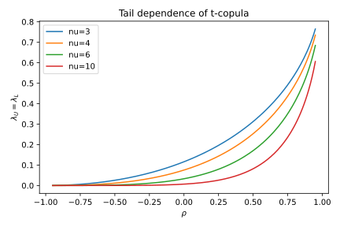

# 2. Student-t Copula

## 2.1 Context and Motivation
The **Student-t copula** extends the Gaussian copula by introducing a
parameter for **degrees of freedom** $(\nu)$ that controls tail
heaviness.  
It was developed to address one of the main limitations of the Gaussian
model: the absence of joint tail dependence.

While the Gaussian copula assumes exponentially decaying tails and
therefore asymptotic independence, the Student-t copula allows
simultaneous extreme events to occur with non-negligible probability,
a property known as **tail dependence**.  
This makes it one of the most useful models for financial risk,
insurance, and stress-testing applications where **co-extremes** are
frequent.

<!-- Added -->
From a probabilistic viewpoint, the t-copula can also be regarded as a
**Gaussian scale mixture**: it corresponds to a Gaussian copula whose
latent correlation structure is modulated by a random scaling factor.
This interpretation connects it naturally to *copula-mixture* models and
explains its ability to reproduce clusters of extreme events.
<!-- End Added -->

---

## 2.2 Mathematical Definition
Let $\Sigma$ be a positive-definite correlation matrix and
$\nu > 2$ degrees of freedom.  
Denote by $t_{\Sigma,\nu}$ and $t_\nu$ the multivariate and univariate
Student-t CDFs, and by $f_{t_{\Sigma,\nu}}$ and $f_{t_\nu}$ their PDFs.

Then the **Student-t copula** $C_{\Sigma,\nu}:[0,1]^d\rightarrow[0,1]$
is defined as

$$
C_{\Sigma,\nu}(u_1,\ldots,u_d)
  = t_{\Sigma,\nu}\!\big(t_\nu^{-1}(u_1),\ldots,t_\nu^{-1}(u_d)\big).
$$

The **density** is obtained analogously to the Gaussian case:

$$
c_{\Sigma,\nu}(u_1,\ldots,u_d)
  = \frac{f_{t_{\Sigma,\nu}}(x_1,\ldots,x_d)}
          {\prod_{i=1}^d f_{t_\nu}(x_i)}, \qquad
    x_i = t_\nu^{-1}(u_i).
$$

### Bivariate case
For $d=2$ with correlation $\rho$, the density simplifies to

$$
c_{\rho,\nu}(u,v)
  = \frac{1}{\sqrt{1-\rho^2}}
     \frac{\Gamma\!\left(\tfrac{\nu+2}{2}\right)}
          {\Gamma\!\left(\tfrac{\nu}{2}\right)}
     \frac{(1 + (x^2 + y^2 - 2\rho xy)/[\nu(1-\rho^2)])^{-(\nu+2)/2}}
          {(1+x^2/\nu)^{-(\nu+1)/2}(1+y^2/\nu)^{-(\nu+1)/2}},
$$
where $x=t_\nu^{-1}(u)$ and $y=t_\nu^{-1}(v)$.

As $\nu \to \infty$, $C_{\Sigma,\nu}$ converges pointwise to the
Gaussian copula $C_\Sigma$.

---

## 2.3 Interpretation and Intuition
The Student-t copula retains the **elliptical geometry** of the Gaussian
family but introduces stochastic scaling in the latent space.

It can be derived as follows:
- Draw $Z\sim N(0,\Sigma)$,
- Draw $S\sim \chi^2_\nu / \nu$ (independent of $Z$),
- Set $Y = Z / \sqrt{S}$,
- Define $U_i = t_\nu(Y_i)$.

The random scaling $\sqrt{S}$ inflates the variance in a random way,
producing occasional large deviations in all components — these manifest
as **simultaneous tail events** on the $[0,1]^d$ domain.

Hence, the t-copula can reproduce both correlation and joint extremes,
and smoothly interpolates between the Gaussian copula ($\nu\to\infty$)
and stronger co-tail structures for smaller $\nu$.

---

## 2.4 Properties and Remarks

| Property | Expression / Description | Implication |
|-----------|--------------------------|--------------|
| **Domain** | $[0,1]^d$ | Uniform marginals |
| **Symmetry** | $C_{\Sigma,\nu}(u)=C_{\Sigma,\nu}(1-u)$ | Elliptical |
| **Tail dependence** | $\lambda_U=\lambda_L = 2\,T_{\nu+1}\!\left(-\sqrt{\frac{\nu+1}{1+\rho}(1-\rho)}\right)$ | Positive, decreases as $\nu↑$ |
| **Kendall’s τ** | $\tau = \tfrac{2}{\pi}\arcsin(\rho)$ | Same as Gaussian |
| **Spearman’s ρ** | $\rho_s = \tfrac{6}{\pi}\arcsin(\tfrac{\rho}{2})$ | Same mapping |
| **Simulation** | 1. Simulate $Z\sim N(0,\Sigma)$ 2. Simulate $S\sim \chi^2_\nu/\nu$ 3. Set $Y=Z/\sqrt{S}$, $U_i=t_\nu(Y_i)$ | Generates joint extremes |
| **Limiting case** | $\nu\!\to\!\infty$ → Gaussian copula | Convergence |
| **Behavior for small ν** | Heavy tails, clustering near corners | Strong co-extremes |

<!-- Added -->
For large $\nu$, an asymptotic expansion of the upper-tail dependence
coefficient gives:
$$
\lambda_U \approx
2\,t_{\nu+1}\!\left(
-\sqrt{\frac{(\nu+1)(1-\rho)}{1+\rho}}
\right)
\;\sim\;
\frac{2}{\sqrt{2\pi(\nu+1)}}
\left(\frac{1+\rho}{1-\rho}\right)^{1/2}
\exp\!\left(-\frac{(\nu+1)(1-\rho)}{2(1+\rho)}\right),
$$
which decays exponentially in $\nu$, confirming that
$\lambda_U,\lambda_L\to 0$ as $\nu\to\infty$ and the copula approaches
the Gaussian limit.
<!-- End Added -->

---

## 2.5 Illustration

**Figure — Student-t copula contours (ρ=0.6, ν=4)**  

Contours of the bivariate t-copula density exhibit the same elliptical
shape as the Gaussian copula but with heavier tails: the density mass
extends deeper into the corners, showing non-negligible joint extremes.

**Figure — Tail dependence λ(ρ, ν)**  

The figure illustrates how tail dependence decreases as $\nu$ increases.
For $\nu=3$, joint extremes remain frequent even for moderate $\rho$,
while for $\nu\ge10$ the copula behaves almost like Gaussian.

**Figure — Simulated pseudo-observations**  

Simulated $(u_1,u_2)$ pairs reveal a clear clustering near $(0,0)$ and
$(1,1)$ — visual evidence of tail dependence.

---

## 2.6 References

- Demarta, L., & McNeil, A. J. (2005).
  *The t Copula and Related Copulas.* *International Statistical Review*,
  73(1), 111–129.  
- Nelsen, R. B. (2006). *An Introduction to Copulas* (2nd ed.). Springer.  
- McNeil, A. J., Frey, R., & Embrechts, P. (2015).
  *Quantitative Risk Management.* Princeton University Press.  
- Joe, H. (2014). *Dependence Modeling with Copulas.* CRC Press.  
- Schmidt, T. (2007). *Tail Dependence.* University of Cologne.
