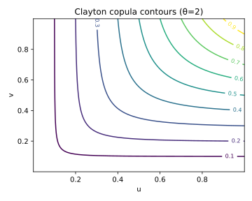

# 3. Clayton Copula

## 3.1 Context and Motivation
The **Clayton copula** is one of the most widely used members of the
Archimedean family.  
It captures **lower-tail dependence** — the tendency for variables to
jointly take small values — while exhibiting weak or no dependence in
the upper tail.

Because of its analytical simplicity and closed-form expressions, the
Clayton copula is frequently applied in **credit risk**, **operational
risk**, and **default clustering models**, where joint adverse outcomes
(e.g., defaults, losses) are more relevant than joint high outcomes.

Mathematically, the Clayton copula arises from an **Archimedean
generator function**, which induces a flexible dependence structure that
can be extended to higher dimensions while maintaining analytical
tractability.

<!-- Added -->
Although the standard definition assumes $\theta>0$, the formulation can
be *extended formally* to $\theta\in[-1,0)$ to obtain a variant that
reverses the dependence structure — generating mild **upper-tail
association** and negative lower-tail dependence.  
This extension, however, no longer satisfies all Archimedean generator
conditions and is mainly used for theoretical or comparative purposes.
<!-- End Added -->

---

## 3.2 Mathematical Definition

An Archimedean copula in dimension $d$ is defined via a *generator*
function $\psi:[0,\infty)\to[0,1]$ that is strictly decreasing,
convex, and satisfies $\psi(0)=1$, $\lim_{t\to\infty}\psi(t)=0$.

For the **Clayton generator**,

$$
\psi_\theta(t) = (1+t)^{-1/\theta}, \qquad \theta > 0.
$$

The corresponding copula is

$$
C_\theta(u_1,\ldots,u_d)
 = \left(
    \sum_{i=1}^d u_i^{-\theta} - d + 1
   \right)^{-1/\theta},
 \qquad \theta > 0.
$$

The **density** (for $d=2$) is

$$
c_\theta(u,v)
 = (1+\theta)
   (uv)^{-(1+\theta)}
   \left(u^{-\theta}+v^{-\theta}-1\right)^{-(2+1/\theta)}.
$$

As $\theta\to0$, the copula converges to the independence copula
$C(u,v)=uv$.  
As $\theta\to\infty$, it approaches the **comonotonic copula**
$C(u,v)=\min(u,v)$.

---

## 3.3 Interpretation and Intuition

The Clayton copula induces stronger dependence in the **lower tail**
region of the distribution (i.e., small $u,v$ values).  
In economic or financial contexts, this translates into
a higher likelihood of simultaneous losses or defaults.

Geometrically, the contours of $C_\theta(u,v)$ are convex toward the
origin, reflecting the asymmetric dependence:  
low outcomes cluster together, while high outcomes remain nearly
independent.

In higher dimensions, this asymmetry persists; the Clayton family is
particularly well-suited for modeling systems where **joint failures are
more likely than joint successes**.

<!-- Added -->
Because of its asymmetric construction, the Clayton family does **not**
admit an internal rotation symmetry.  
To obtain upper-tail dependence, one must explicitly use a *rotated* or
*survival Clayton* transformation, defined by replacing $(u,v)$ with
$(1-u,1-v)$ or by partial rotations of the margins.
<!-- End Added -->

---

## 3.4 Properties and Remarks

| Property | Expression / Description | Implication |
|-----------|--------------------------|--------------|
| **Generator** | $\psi_\theta(t)=(1+t)^{-1/\theta}$ | Archimedean |
| **Parameter range** | $\theta>0$ | Controls dependence strength |
| **Kendall’s τ** | $\tau = \frac{\theta}{\theta+2}$ | Monotonic mapping |
| **Tail dependence** | $\lambda_L = 2^{-1/\theta}$, $\lambda_U = 0$ | Lower-tail dependent only |
| **Symmetry** | Asymmetric | Stronger lower tail |
| **Limit cases** | $\theta\to0$: independence, $\theta\to\infty$: comonotonic | Continuous interpolation |
| **Simulation** | 1. Simulate $W\sim \text{Gamma}(1/\theta,1)$ 2. Draw $E_i\sim \text{Exp}(1)$ 3. Set $U_i=(1+E_i/W)^{-1/\theta}$ | Efficient algorithm |
| **Family type** | Archimedean, associative | Easily generalized to $d>2$ |

---

## 3.5 Illustration

**Figure — Clayton copula density contours (θ=2)**  

The figure shows the strong curvature of density contours near the
origin, emphasizing lower-tail clustering.  
Upper tails are nearly independent, consistent with
$\lambda_U=0$.

**Figure — Simulated pseudo-observations (θ=2)**  

Samples $(u_1,u_2)$ demonstrate pronounced concentration in the bottom
left corner (joint small values), confirming asymmetric dependence.

---

## 3.6 References

- Nelsen, R. B. (2006). *An Introduction to Copulas* (2nd ed.). Springer.  
- Joe, H. (2014). *Dependence Modeling with Copulas.* CRC Press.  
- McNeil, A. J., Frey, R., & Embrechts, P. (2015).
  *Quantitative Risk Management.* Princeton University Press.  
- Genest, C., & Rivest, L.-P. (1993).
  *Statistical Inference Procedures for Bivariate Archimedean Copulas.*
  *Journal of the American Statistical Association*, 88(423), 1034–1043.  
- Hofert, M. (2008). *Sampling Archimedean Copulas.*  
  *Computational Statistics & Data Analysis*, 52(12), 5163–5174.
