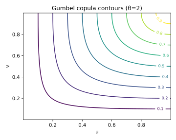

# 4. Gumbel Copula

## 4.1 Context and Motivation
The **Gumbel copula** is another key member of the Archimedean family,
complementary to the Clayton copula.  
While Clayton captures *lower-tail* dependence (joint small outcomes),
Gumbel captures *upper-tail* dependence — the clustering of **large
values**.

This makes the Gumbel copula particularly suitable for modeling
phenomena such as:
- Joint large insurance claims or losses,
- Concentrated asset price increases,
- Extremes in environmental or actuarial data.

It is often associated with the **Extreme Value Theory (EVT)**
framework, as it can be derived as a special case of an *Extreme Value
copula*.

<!-- Added -->
Indeed, the Gumbel copula belongs to the class of **Extreme-Value (EV) copulas**,
and its dependence structure can be represented through a *Pickands dependence function*:
$$
A_\theta(t) = \big[t^{\theta} + (1-t)^{\theta}\big]^{1/\theta}, \qquad t\in[0,1].
$$
This form links the Gumbel copula to the max-stable family discussed in
Section 9, highlighting its role as the canonical *EV copula* with upper-tail
dependence.
<!-- End Added -->

---

## 4.2 Mathematical Definition

An Archimedean copula is defined via a generator $\psi_\theta$ that is
completely monotone on $[0,\infty)$.  
For the **Gumbel generator**, we have

$$
\psi_\theta(t) = \exp\!\big(-t^{1/\theta}\big), \qquad \theta \ge 1.
$$

The Gumbel copula is thus

$$
C_\theta(u_1,\ldots,u_d)
 = \exp\!\left(
   -\!\left[\sum_{i=1}^d (-\ln u_i)^{\theta}\right]^{1/\theta}
   \right), \qquad \theta \ge 1.
$$

For $d=2$:

$$
C_\theta(u,v)
 = \exp\!\left(-\!\big[(-\ln u)^{\theta} + (-\ln v)^{\theta}\big]^{1/\theta}\right).
$$

The **density** (bivariate case) is

$$
c_\theta(u,v)
 = C_\theta(u,v)
   \frac{(-\ln u)^{\theta-1}(-\ln v)^{\theta-1}}
        {uv\big[(-\ln u)^{\theta}+(-\ln v)^{\theta}\big]^{2-1/\theta}}
   \left(
     \theta-1+ \big[(-\ln u)^{\theta}+(-\ln v)^{\theta}\big]^{1/\theta}
   \right).
$$

As $\theta \to 1$, $C_\theta(u,v) \to uv$ (independence).  
As $\theta \to \infty$, $C_\theta(u,v) \to \min(u,v)$ (comonotonic).

---

## 4.3 Interpretation and Intuition

The Gumbel copula is **upper-tail dependent**, meaning it models
stronger association among high values than among low ones.  
In economic or risk terms, it describes the phenomenon where
large outcomes — e.g., simultaneous high returns or extreme losses —
are more likely to co-occur.

Geometrically, the copula’s level curves are **concave toward the
(1,1) corner**, concentrating mass in the upper right region of the unit
square.  
This asymmetry is the mirror image of the Clayton copula’s lower-tail
clustering.

For this reason, Gumbel and Clayton are often viewed as **dual copulas**
in the sense of tail behavior.

---

## 4.4 Properties and Remarks

| Property | Expression / Description | Implication |
|-----------|--------------------------|--------------|
| **Generator** | $\psi_\theta(t)=\exp(-t^{1/\theta})$ | Archimedean, completely monotone |
| **Parameter range** | $\theta \ge 1$ | Controls upper-tail dependence |
| **Kendall’s τ** | $\tau = 1 - \tfrac{1}{\theta}$ | Monotonic mapping |
| **Tail dependence** | $\lambda_U = 2 - 2^{1/\theta}$, $\lambda_L = 0$ | Upper-tail dependent |
| **Symmetry** | Asymmetric | Stronger dependence for large $u,v$ |
| **Limit cases** | $\theta\to1$: independence; $\theta\to\infty$: comonotonic | Continuous interpolation |
| **Simulation** | 1. Simulate $E_i\sim \text{Exp}(1)$ 2. Set $S=(E_1^{\theta}+E_2^{\theta})^{1/\theta}$ 3. Compute $U_i=\exp(-E_i/S)$ | Based on stable distributions |
| **Family type** | Archimedean, associative | Easily extends to higher $d$ |

<!-- Added -->
**Numerical note:**  
The simulation algorithm involving $\alpha$-stable random variables (for general $d$)
may suffer from numerical instability for large $\theta$.
Accurate implementations should use high-precision sampling or logarithmic transforms
of the stable variates to avoid underflow in $\exp(-E_i/S)$ computations.
<!-- End Added -->

---

## 4.5 Illustration

**Figure — Gumbel copula density contours (θ=2)**  

The contours show strong curvature toward the upper-right corner,
indicating increased dependence for large values.  
In contrast to the Clayton copula, dependence fades for low values.

**Figure — Simulated pseudo-observations (θ=2)**  

Simulated $(u_1,u_2)$ pairs reveal clustering near $(1,1)$ and near
independence for small $(u,v)$, confirming the asymmetric tail behavior.

**Figure — Comparison of tail dependence λ(θ)**  

The function $\lambda_U = 2 - 2^{1/\theta}$ increases monotonically with
$\theta$, showing how upper-tail dependence strengthens with larger
values of $\theta$.

---

## 4.6 References

- Nelsen, R. B. (2006). *An Introduction to Copulas* (2nd ed.). Springer.  
- Joe, H. (2014). *Dependence Modeling with Copulas.* CRC Press.  
- McNeil, A. J., Frey, R., & Embrechts, P. (2015).
  *Quantitative Risk Management.* Princeton University Press.  
- Gumbel, E. J. (1960). *Bivariate Exponential Distributions.*  
  *Journal of the American Statistical Association*, 55(292), 698–707.  
- Genest, C., & Favre, A.-C. (2007). *Everything You Always Wanted to
  Know about Copula Modeling but Were Afraid to Ask.*  
  *Journal of Hydrologic Engineering*, 12(4), 347–368.
