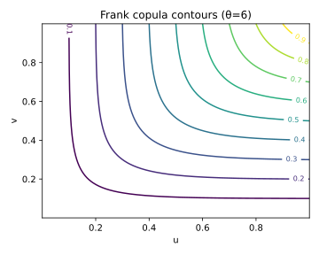
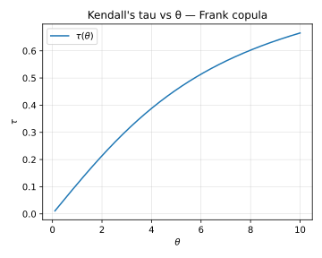

# 5. Frank Copula

## 5.1 Context and Motivation
The **Frank copula** is a symmetric member of the Archimedean family.
Unlike the Clayton and Gumbel copulas — which exhibit asymmetric tail
dependence — the Frank copula features **no tail dependence** but allows
both *positive and negative* association through its single parameter
$\theta \in \mathbb{R}\setminus\{0\}$.

Because of its flexibility and neutrality in the tails, it is often used
as a **benchmark copula** for fitting data that exhibit moderate,
symmetric dependence without pronounced extremes.  
It also enjoys simple closed forms and efficient simulation schemes,
making it a convenient choice for applied modeling.

<!-- Added -->
Unlike Gumbel or Clayton, the Frank copula does **not** belong to the class of
Extreme-Value (EV) copulas.  
It cannot reproduce persistent tail dependence, since its joint tail
probabilities decay exponentially fast — hence it serves as a *neutral*
or *baseline* copula for symmetric, tail-independent dependence
structures.
<!-- End Added -->

---

## 5.2 Mathematical Definition

The **generator function** of the Frank copula is

$$
\psi_\theta(t)
 = -\frac{1}{\theta}\ln\!\big(1 - (1-e^{-\theta})e^{-t}\big),
 \qquad \theta \ne 0.
$$

From the Archimedean definition, the Frank copula in $d$ dimensions is

$$
C_\theta(u_1,\ldots,u_d)
 = -\frac{1}{\theta}
    \ln\!\left[
      1 + \frac{\prod_{i=1}^d (e^{-\theta u_i}-1)}
                  {(e^{-\theta}-1)^{d-1}}
    \right],
 \qquad \theta \ne 0.
$$

For $d=2$:

$$
C_\theta(u,v)
 = -\frac{1}{\theta}
   \ln\!\left[
     1 + \frac{(e^{-\theta u}-1)(e^{-\theta v}-1)}
                {e^{-\theta}-1}
   \right].
$$

The **density** is

$$
c_\theta(u,v)
 = \frac{-\theta (1-e^{-\theta})(e^{-\theta(u+v)} - e^{-\theta(u+v-1)})}
        {(e^{-\theta}-1)
         \left[
           1 - (1-e^{-\theta})(1-e^{-\theta u})(1-e^{-\theta v})/(e^{-\theta}-1)
         \right]^2}.
$$

Limits:
- $\theta \to 0$ ⇒ Independence copula $C(u,v)=uv$.
- $\theta \to +\infty$ ⇒ Comonotonic copula $C(u,v)=\min(u,v)$.
- $\theta \to -\infty$ ⇒ Countermonotonic copula $C(u,v)=\max(u+v-1,0)$.

---

## 5.3 Interpretation and Intuition

The Frank copula induces **symmetric dependence**: it treats upper and
lower tails equally, producing association of moderate strength in both
directions.  
It can represent both positive and negative dependence, depending on the
sign of $\theta$.

Geometrically, the contours of $C_\theta(u,v)$ are “S-shaped” — curved
toward the main diagonal when $\theta>0$ (positive dependence) and
toward the anti-diagonal when $\theta<0$ (negative dependence).

In practice, it serves as a *neutral baseline* for data lacking tail
features. In financial contexts, it is often used for
interest-rate or spread pairs that move together but do not exhibit
extremes.

---

## 5.4 Properties and Remarks

| Property | Expression / Description | Implication |
|-----------|--------------------------|--------------|
| **Generator** | $\psi_\theta(t) = -\frac{1}{\theta}\ln(1-(1-e^{-\theta})e^{-t})$ | Archimedean |
| **Parameter range** | $\theta \in \mathbb{R}\setminus\{0\}$ | Controls association |
| **Kendall’s τ** | $\tau = 1 - \tfrac{4}{\theta}\left(1 - \tfrac{D_1(\theta)}{\theta}\right)$ | Computed via Debye function |
| **Tail dependence** | $\lambda_U = \lambda_L = 0$ | No tail clustering |
| **Symmetry** | Symmetric | Balanced tails |
| **Limit cases** | $\theta \to 0$: independence; ±∞: (counter)monotonic | Smooth transition |
| **Simulation** | 1. Draw $U\sim \text{Uniform}(0,1)$ 2. Draw $V$ via inverse conditional CDF 3. Use $C_\theta(u,v)$ structure | Simple inversion method |
| **Family type** | Archimedean, associative | Extends easily to $d>2$ |

### The Debye function
The Debye function $D_1(\theta)$ appearing in Kendall’s τ is defined as

$$
D_1(\theta)
 = \frac{1}{\theta}\int_0^\theta \frac{t}{e^t - 1}\,dt.
$$

This expression ensures a smooth mapping between $\theta$ and $\tau$,
useful for initial parameter estimation (τ-inversion).

---

## 5.5 Illustration

**Figure — Frank copula density contours (θ=6)**  

The contours are symmetric about the main diagonal and show mild
dependence in both tails. No corner clustering occurs, confirming
$\lambda_U=\lambda_L=0$.

**Figure — Simulated pseudo-observations (θ=6)**  

Pseudo-observations exhibit moderate association with symmetric spread.
When $\theta<0$, the points would align along the opposite diagonal,
reflecting negative dependence.

**Figure — Kendall’s τ vs parameter θ**  

The τ(θ) curve shows a smooth monotonic increase, approaching
$\tau\!\to\!1$ as $\theta\!\to\!\infty$ and $\tau\!\to\!-1$ as
$\theta\!\to\!-\infty$.

---

## 5.6 References

- Nelsen, R. B. (2006). *An Introduction to Copulas* (2nd ed.). Springer.  
- Joe, H. (2014). *Dependence Modeling with Copulas.* CRC Press.  
- McNeil, A. J., Frey, R., & Embrechts, P. (2015).
  *Quantitative Risk Management.* Princeton University Press.  
- Genest, C., & Rivest, L.-P. (1993).
  *Statistical Inference Procedures for Bivariate Archimedean Copulas.*
  *JASA*, 88(423), 1034–1043.  
- Frank, M. J. (1979). *On the Simultaneous Associativity of F(x,y) and
  F(y,x).* *Aequationes Mathematicae*, 19(1), 194–226.
