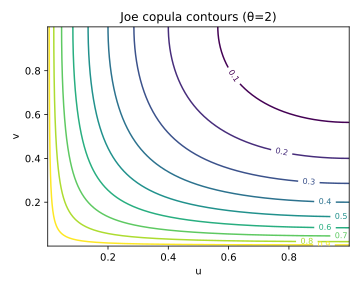
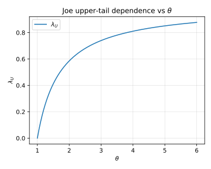

# 6. Joe Copula

## 6.1 Context and Motivation
The **Joe copula** is an upper-tail dependent Archimedean copula, part
of the same family as Gumbel and BB1–BB8 hybrid models.  
It is designed to capture **strong co-movements among large values**
while maintaining weaker dependence among small values.

Compared to the Gumbel copula, the Joe copula exhibits **sharper upper-
tail clustering**, making it highly relevant in contexts such as:
- joint large losses in insurance portfolios,
- upper quantile dependence of market factors,
- or risk aggregation in extreme financial stress scenarios.

Its analytical form and smooth generator make it a preferred choice for
flexible modeling of asymmetric dependence structures.

---

## 6.2 Mathematical Definition

The **generator function** of the Joe copula is

$$
\psi_\theta(t)
 = 1 - (1 - e^{-t})^{1/\theta}, \qquad \theta \ge 1.
$$

Hence, the **Joe copula** in $d$ dimensions is

$$
C_\theta(u_1,\ldots,u_d)
 = 1 - \left[\prod_{i=1}^d (1 - u_i)^{\theta}
     \right]^{1/\theta}
     \sum_{k=1}^d \text{(higher-order terms)}.
$$

<!-- Added -->
*Note:* The omitted higher-order terms correspond to combinatorial
sums involving products of $(1-u_i)^\theta$ across all subsets of
indices.  
For the full expression and derivation, see **Joe (1997, Chapter 4)**,
where the author provides the closed form for arbitrary $d$ and discusses
its inclusion within the BB6–BB8 hybrid hierarchy.
<!-- End Added -->

For the **bivariate case**, the closed form is compact:

$$
C_\theta(u,v)
 = 1 - \left[(1 - (1 - u)^{\theta})(1 - (1 - v)^{\theta})\right]^{1/\theta}.
$$

The **density** (for $d=2$) is

$$
c_\theta(u,v)
 = C_\theta(u,v)
   \frac{
     \theta(\theta-1)(1-u)^{\theta-1}(1-v)^{\theta-1}
     \big[1-(1-u)^{\theta}\big]^{1/\theta-1}
     \big[1-(1-v)^{\theta}\big]^{1/\theta-1}
   }{
     \left\{
       1 - \big[(1 - (1-u)^{\theta})(1 - (1-v)^{\theta})\big]^{1/\theta}
     \right\}^{2}
   }.
$$

Limits:
- $\theta \to 1$: Independence copula $C(u,v)=uv$.  
- $\theta \to \infty$: Comonotonic copula $C(u,v)=\min(u,v)$.

---

## 6.3 Interpretation and Intuition

The Joe copula models **strong upper-tail dependence** and almost no
lower-tail dependence.  
This means that extreme high outcomes (large $u,v$) tend to co-occur,
while small values behave almost independently.

Geometrically, its density contours are **sharply curved toward the
(1,1) corner**, showing higher concentration of probability mass in that
region than in the Gumbel copula.  
The rate of decay toward the origin is much faster, confirming the
asymmetry.

For applications, the Joe copula is particularly effective in
**extreme-value modeling** and in describing dependence structures with
dominant upper-tail interactions but limited systemic behavior in the
lower tail.

<!-- Added -->
In the classification of **Joe (1997)**, this copula serves as a *building block*
for the **BB6–BB8 hybrid families**, which combine its sharp upper-tail
behavior with additional parameters that control lower-tail or symmetric
effects.  
It therefore acts as a conceptual bridge between one-parameter and
two-parameter Archimedean copulas.
<!-- End Added -->

---

## 6.4 Properties and Remarks

| Property | Expression / Description | Implication |
|-----------|--------------------------|--------------|
| **Generator** | $\psi_\theta(t)=1-(1-e^{-t})^{1/\theta}$ | Archimedean |
| **Parameter range** | $\theta \ge 1$ | Controls strength of upper-tail dependence |
| **Kendall’s τ** | $\tau = 1 - 4\!\sum_{k=1}^{\infty}\frac{1}{k(\theta k+2)(\theta(k+1)+2)}$ | Monotonic in $\theta$ |
| **Tail dependence** | $\lambda_U = 2 - 2^{1/\theta}$, $\lambda_L = 0$ | Upper-tail dependent only |
| **Symmetry** | Asymmetric | Stronger upper tail |
| **Limit cases** | $\theta\to1$: independence; $\theta\to\infty$: comonotonic | Continuous interpolation |
| **Simulation** | 1. Simulate $E_i\sim \text{Exp}(1)$ 2. Generate $U_i = 1 - (1 - e^{-E_i/S})^{1/\theta}$ 3. $S=(E_1^{\theta}+E_2^{\theta})^{1/\theta}$ | Stable-based method |
| **Family type** | Archimedean | Member of BB1–BB8 hybrid hierarchy |

---

## 6.5 Illustration

**Figure — Joe copula density contours (θ=2)**  

The contours display a pronounced curvature toward $(1,1)$, indicating
strong upper-tail clustering. The density decays rapidly for small
$(u,v)$, demonstrating negligible lower-tail association.

**Figure — Simulated pseudo-observations (θ=2)**  

Samples $(u_1,u_2)$ show dense concentration in the upper-right corner
and near-uniform spread elsewhere.

**Figure — Upper-tail dependence λ_U(θ)**  

The function $\lambda_U = 2 - 2^{1/\theta}$ grows monotonically with
$\theta$, showing increasing strength of co-extremes.

---

## 6.6 References

- Nelsen, R. B. (2006). *An Introduction to Copulas* (2nd ed.). Springer.  
- Joe, H. (1997). *Multivariate Models and Dependence Concepts.*
  Chapman & Hall.  
- McNeil, A. J., Frey, R., & Embrechts, P. (2015).
  *Quantitative Risk Management.* Princeton University Press.  
- Joe, H. (2014). *Dependence Modeling with Copulas.* CRC Press.  
- Hofert, M., Kojadinovic, I., Maechler, M., & Yan, J. (2018).
  *Elements of Copula Modeling with R.* Springer.
