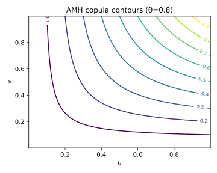
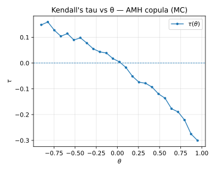

# 7. Ali–Mikhail–Haq (AMH) Copula

## 7.1 Context and Motivation
The **Ali–Mikhail–Haq (AMH)** copula is an Archimedean copula introduced
by Ali, Mikhail, and Haq (1978).  
It represents one of the earliest flexible one-parameter copula models
capable of generating both positive and negative dependence.

Its key feature is its **bounded parameter range**
$\theta \in [-1,1)$, which guarantees that it remains valid and
well-defined across all possible correlations, including mild negative
association.  
Unlike Gumbel or Clayton, the AMH copula exhibits **no tail dependence**,
making it suitable for modeling moderate, symmetric dependence without
co-extreme behavior.

It serves as a simple yet effective benchmark model in dependence
studies and stress-testing frameworks.

<!-- Added -->
Although it can be generalized to dimensions $d>2$, such extensions
cease to be *strictly Archimedean*, because the associativity condition
fails to hold beyond the bivariate case.  
Consequently, the AMH copula is mainly used in two-dimensional settings
or as a component in **mixture and benchmarking frameworks** where
simplicity and bounded dependence are desirable.
<!-- End Added -->

---

## 7.2 Mathematical Definition

The **generator function** of the AMH copula is

$$
\psi_\theta(t)
 = \frac{1 - \theta}{e^t - \theta}, \qquad \theta \in [-1,1).
$$

From the general Archimedean form, the copula is

$$
C_\theta(u,v)
 = \frac{uv}{
     1 - \theta(1-u)(1-v)
   }, \qquad \theta \in [-1,1).
$$

For $\theta = 0$, this reduces to the **independence copula**
$C(u,v)=uv$.  
As $\theta \to 1^{-}$, the dependence increases toward comonotonicity,
though never reaches perfect correlation.  
As $\theta \to -1$, the dependence becomes countermonotonic.

The **density** is:

$$
c_\theta(u,v)
 = \frac{(1-\theta)
         [1 - \theta(1-u)(1-v) + \theta(1-u)(1-v)]}
        {[1 - \theta(1-u)(1-v)]^3}.
$$

In higher dimensions, extensions exist but lose associativity, hence
AMH is primarily used in bivariate modeling.

---

## 7.3 Interpretation and Intuition

The AMH copula is **symmetric** and **bounded in strength** — it models
both positive and negative dependence, but its range is limited.  
Its correlation strength (Kendall’s $\tau$ or Spearman’s $\rho_s$)
is restricted to $|\tau| < 0.333$, reflecting weak-to-moderate
association.

Geometrically, level curves of the AMH copula are smooth and centered
around the main diagonal for $\theta>0$ and the anti-diagonal for
$\theta<0$, without tail curvature.

The copula is particularly suitable for **benchmarking weak dependence**
or in **mixture models** where AMH serves as a neutral baseline.

<!-- Added -->
Because of its bounded range and analytical simplicity, the AMH copula
is often employed as a **baseline in comparative studies** or as a
**component in copula mixtures**.  
Its weak but symmetric dependence provides a controlled reference case
against which stronger or asymmetric families can be evaluated.
<!-- End Added -->

---

## 7.4 Properties and Remarks

| Property | Expression / Description | Implication |
|-----------|--------------------------|--------------|
| **Generator** | $\psi_\theta(t) = \frac{1-\theta}{e^t - \theta}$ | Archimedean |
| **Parameter range** | $\theta \in [-1,1)$ | Allows weak negative or positive dependence |
| **Kendall’s τ** | $\tau = 1 - \tfrac{2(1-\theta)^2}{3\theta^2}\ln(1-\theta) - \tfrac{4(1-\theta)}{3\theta}$ | Weak dependence |
| **Tail dependence** | $\lambda_U = \lambda_L = 0$ | No tail clustering |
| **Symmetry** | Symmetric | Balanced dependence |
| **Limit cases** | $\theta \to 0$: independence; $\theta \to 1^{-}$: upper limit of positive dependence | Smooth limits |
| **Simulation** | 1. Draw $U\sim U(0,1)$ 2. Generate $V$ from conditional $C_\theta(u,v)$ via inversion | Efficient algorithm |
| **Family type** | Archimedean | Simple one-parameter model |

---

## 7.5 Illustration

**Figure — AMH copula density contours (θ=0.8)**  

Contours exhibit mild symmetric curvature around the main diagonal, with
no evidence of upper or lower tail clustering.

**Figure — Simulated pseudo-observations (θ=0.8)**  

Simulated samples show weak positive association.  
When $\theta$ is negative (e.g., $-0.5$), the pattern flips along the
anti-diagonal, confirming negative dependence.

**Figure — Kendall’s τ vs parameter θ**  

The $\tau(\theta)$ curve demonstrates the limited range of dependence:
as $\theta \to 1$, $\tau$ saturates near 0.33, confirming the copula’s
bounded association.

---

## 7.6 References

- Ali, M. M., Mikhail, N. N., & Haq, M. S. (1978).
  *A Class of Bivariate Distributions Including the Bivariate Logistic.*
  *Journal of Multivariate Analysis*, 8(3), 405–412.  
- Nelsen, R. B. (2006). *An Introduction to Copulas* (2nd ed.). Springer.  
- Joe, H. (2014). *Dependence Modeling with Copulas.* CRC Press.  
- Genest, C., & Rivest, L.-P. (1993). *Statistical Inference Procedures
  for Bivariate Archimedean Copulas.* *JASA*, 88(423), 1034–1043.  
- McNeil, A. J., Frey, R., & Embrechts, P. (2015).
  *Quantitative Risk Management.* Princeton University Press.
