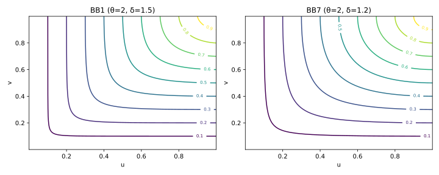
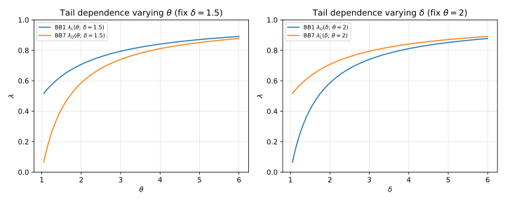

# 8. Advanced BB Families (Two-Parameter Archimedean Copulas)

## 8.1 Context and Motivation
The **BB families** (Blomqvist–Burr, or “Bivariate B” series) form a set
of *two-parameter Archimedean copulas* that generalize the simpler
Clayton, Gumbel, and Joe families by introducing a second parameter to
control **asymmetry and tail balance**.

Each BB family (BB1–BB8) can be viewed as a *bridge* between two simpler
copulas — combining, for example, lower-tail behavior of Clayton with
upper-tail behavior of Gumbel.  
This dual flexibility allows for a more realistic description of
empirical dependence structures that exhibit both co-extreme losses and
co-extreme gains.

They are extensively used in:
- **Credit and operational risk aggregation**,  
- **Hydrology and insurance modeling**,  
- **Stress testing**, where asymmetric tail behavior must be captured.

<!-- Added -->
Following the classification of **Joe (1997)**, these eight two-parameter
models (BB1–BB8) constitute the *complete family of
two-parameter Archimedean copulas*, unifying one-parameter models
(Clayton, Gumbel, Joe, Frank) under a single framework that allows
independent control of tail asymmetry and overall dependence.
<!-- End Added -->

---

## 8.2 Mathematical Definition

Each BB family is defined by an Archimedean generator $\psi_{\theta,\delta}(t)$
with **two positive parameters** $(\theta, \delta)$ controlling
dependence strength and asymmetry.  
All members satisfy the Archimedean conditions:
$\psi(0)=1$, $\psi(\infty)=0$, and complete monotonicity on $[0,\infty)$$.$

### BB1 (Clayton–Gumbel or “Clayton–Gumbel Mix”)

$$
\psi_{\theta,\delta}(t)
 = \big(1 + t^{1/\delta}\big)^{-1/\theta}, \quad \theta,\delta > 0.
$$

$$
C_{\theta,\delta}(u,v)
 = \left[
     1 + \left(
       (u^{-\theta}-1)^{\delta} + (v^{-\theta}-1)^{\delta}
     \right)^{1/\delta}
   \right]^{-1/\theta}.
$$

**Tail dependence:**  
$\lambda_L = 2^{-1/(\theta\delta)}, \quad
 \lambda_U = 2 - 2^{1/\delta}.$

**Special cases:**  
- $\delta=1$ → Clayton copula  
- $\theta=1$ → Gumbel copula

---

### BB6 (Joe–Gumbel)

$$
\psi_{\theta,\delta}(t)
 = 1 - \big(1 - e^{-t^{1/\delta}}\big)^{1/\theta},
 \quad \theta,\delta \ge 1.
$$

$$
C_{\theta,\delta}(u,v)
 = 1 - \left[
     1 - \left(
       1 - (1 - u)^{\theta}
     \right)^{\delta}
       \left(
       1 - (1 - v)^{\theta}
     \right)^{\delta}
   \right]^{1/(\theta\delta)}.
$$

**Tail dependence:**  
$\lambda_U = 2 - 2^{1/(\theta\delta)}, \quad
 \lambda_L = 0.$

**Special cases:**  
- $\delta=1$ → Joe copula  
- $\theta=1$ → Gumbel copula

---

### BB7 (Joe–Clayton or “BB7 / Tawn type I”)

$$
\psi_{\theta,\delta}(t)
 = 1 - \left[1 - (1+t)^{-1/\theta}\right]^{1/\delta},
 \quad \theta,\delta > 0.
$$

$$
C_{\theta,\delta}(u,v)
 = 1 - \left[
     1 - \left(
       (1 - (1-u)^{\theta})^{-\delta} + (1 - (1-v)^{\theta})^{-\delta} - 1
     \right)^{-1/\delta}
   \right]^{1/\theta}.
$$

**Tail dependence:**  
$\lambda_L = 2^{-1/\delta}, \quad
 \lambda_U = 2 - 2^{1/\theta}.$

**Special cases:**  
- $\delta=1$ → Joe copula  
- $\theta\to\infty$ → Clayton copula

---

### BB8 (Joe–Frank)

$$
\psi_{\theta,\delta}(t)
 = 1 - \left(1 - \frac{1 - e^{-\delta t}}{1 - e^{-\delta}}\right)^{1/\theta},
 \quad \theta \ge 1,\, \delta > 0.
$$

This generator interpolates between Frank-like symmetric dependence and
Joe-type upper-tail clustering.  
It is used for flexible modeling when empirical data show *weak tails*
but nonlinear association in the middle range.

---

## 8.3 Interpretation and Intuition

Each BB family combines properties of two parent copulas to produce a
more flexible dependence structure:

| Family | Parent 1 | Parent 2 | Tail behavior | Comments |
|---------|-----------|-----------|----------------|-----------|
| **BB1** | Clayton | Gumbel | Both tails | Most commonly used |
| **BB6** | Joe | Gumbel | Upper tail | Flexible EVT-type |
| **BB7** | Joe | Clayton | Upper + Lower | Asymmetric, realistic |
| **BB8** | Joe | Frank | Mild tails | Smooth mid-dependence |

<!-- Added -->
### Parent–Family Relationships Overview

| BB Family | Parent 1 | Parent 2 | Behavior | Archimedean Range |
|------------|-----------|-----------|------------|------------------|
| **BB1** | Clayton | Gumbel | Both tails active | $\theta,\delta>0$ |
| **BB6** | Joe | Gumbel | Upper-tail only | $\theta,\delta\ge1$ |
| **BB7** | Joe | Clayton | Asymmetric (both tails) | $\theta,\delta>0$ |
| **BB8** | Joe | Frank | Symmetric, weak tails | $\theta\ge1$, $\delta>0$ |

This table highlights the *parental lineage* of each family and the type
of asymmetry it models.  
It emphasizes the BB series’ role as the **generalized Archimedean
spectrum**, where each pair $(\theta,\delta)$ controls distinct tail
regions.
<!-- End Added -->

The dual-parameter structure allows independent tuning of:
- **Overall dependence strength (θ)**  
- **Tail asymmetry / heaviness (δ)**  

This makes BB families particularly effective for **empirical fitting**,
where different parts of the joint distribution behave differently.

---

## 8.4 Properties and Remarks

| Family | Parameter domain | Tail dependence | Symmetry | Special cases |
|---------|------------------|-----------------|-----------|----------------|
| **BB1** | $\theta>0$, $\delta>0$ | $\lambda_L>0$, $\lambda_U>0$ | Asymmetric | Gumbel, Clayton |
| **BB6** | $\theta,\delta\ge1$ | $\lambda_U>0$, $\lambda_L=0$ | Asymmetric | Joe, Gumbel |
| **BB7** | $\theta,\delta>0$ | $\lambda_U>0$, $\lambda_L>0$ | Asymmetric | Joe, Clayton |
| **BB8** | $\theta\ge1$, $\delta>0$ | $\lambda_U=\lambda_L=0$ | Symmetric | Joe, Frank |

These models unify the Archimedean families under a **two-parameter
hierarchy**, bridging elliptical and extreme-value behaviors.

<!-- Added -->
### Calibration and Estimation Challenges

In practice, **fitting BB copulas** can be numerically demanding due to:
- **Non-convex likelihood surfaces**, leading to local optima,  
- **Strong parameter correlation** between $(\theta,\delta)$, reducing
  identifiability,  
- And sensitivity of tail estimates to small data perturbations.

Regularization, good initialization (e.g., method-of-moments), and
profile likelihood approaches are often recommended for stable
calibration.
<!-- End Added -->

---

## 8.5 Illustration

**Figure — Density contours for representative BB families**  

Contours demonstrate how additional parameters $(\theta,\delta)$ control
both the curvature (overall dependence) and the relative strength of the
upper vs. lower tail clustering.

**Figure — Tail dependence comparison across BB1–BB8**  

The figure compares theoretical tail-dependence coefficients across BB
families, highlighting their flexibility and generalization of simpler
copulas.

**Figure — Pseudo-observations simulated from BB1 and BB7**  

Simulated samples confirm the capability of BB1 and BB7 to capture both
joint losses and gains, a feature absent in single-parameter copulas.

---

## 8.6 References

- Nelsen, R. B. (2006). *An Introduction to Copulas* (2nd ed.). Springer.  
- Joe, H. (2014). *Dependence Modeling with Copulas.* CRC Press.  
- McNeil, A. J., Frey, R., & Embrechts, P. (2015).
  *Quantitative Risk Management.* Princeton University Press.  
- Manner, H., & Segers, J. (2011).
  *Tails of Correlation Mixtures of Extreme-Value Copulas.*
  *Insurance: Mathematics and Economics*, 48(1), 153–160.  
- Hofert, M., Kojadinovic, I., Maechler, M., & Yan, J. (2018).
  *Elements of Copula Modeling with R.* Springer.
