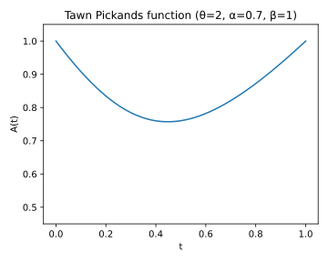
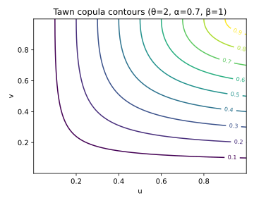

# 9. Tawn and Extreme-Value Copulas

## 9.1 Context and Motivation
**Extreme-value (EV) copulas** represent the limiting dependence
structures that arise from **componentwise maxima** of random samples.
They capture the behavior of **joint extremes** — events where multiple
variables simultaneously reach high quantiles — which is crucial in
fields such as risk management, hydrology, environmental science, and
systemic financial stress modeling.

Among EV copulas, the **Tawn copula** family provides one of the most
flexible asymmetric extensions of the Gumbel model, capable of modeling
different strengths of dependence in the upper-right quadrant depending
on the direction of extremes.

It generalizes the Gumbel copula through an additional asymmetry
parameter, allowing different tail dependence for the two margins while
retaining the extreme-value property.

<!-- Added -->
**Type I vs Type II.** The formulation typically referred to as **Tawn Type I**
models **asymmetric upper-tail** dependence (appropriate for maxima).
The **Tawn Type II** variant is obtained via survival/rotation
transformations (or by working with minima instead of maxima) and
emphasizes **asymmetric lower-tail** behavior. In practice, Type II can
be constructed from Type I by applying $(u,v)\mapsto (1-u,1-v)$ (or
marginal one-sided rotations) to target lower-tail asymmetry.
<!-- End Added -->

---

## 9.2 Mathematical Definition

### 9.2.1 Extreme-Value Copulas

An EV copula can be represented through a **Pickands dependence function**
$A:[0,1]\to[1/2,1]$ as:

$$
C(u,v)
 = \exp\!\left(
   \ln(uv)\,
   A\!\left(
     \frac{\ln v}{\ln(uv)}
   \right)
 \right), \qquad (u,v)\in[0,1]^2.
$$

The function $A(t)$ is convex and satisfies:
$$
\max(t,1-t)\le A(t)\le 1.
$$

- $A(t)=1$ gives the **independence copula** $C(u,v)=uv$.
- $A(t)=\max(t,1-t)$ gives the **comonotonic copula** $C(u,v)=\min(u,v)$.
- Intermediate shapes of $A(t)$ correspond to varying degrees of
  extremal dependence.

---

### 9.2.2 Gumbel (EV type) as a special case

The **Gumbel copula** can be expressed in this framework as:

$$
A_\theta(t)
 = \left[
    t^{\theta} + (1-t)^{\theta}
   \right]^{1/\theta}, \quad \theta \ge 1.
$$

This defines a symmetric extreme-value copula with constant tail
dependence $\lambda_U = 2 - 2^{1/\theta}$.

---

### 9.2.3 Tawn Copula (Type I and II)

The **Tawn copula** generalizes Gumbel’s by introducing two
asymmetry parameters $(\alpha,\beta)$ that modulate dependence strength
in each margin:

$$
C_{\theta,\alpha,\beta}(u,v)
 = \exp\!\left[
   -\!\left\{
     (-\ln u)^{\theta}\alpha +
     (-\ln v)^{\theta}\beta
   \right\}^{1/\theta}
 \right],
$$

with $\theta \ge 1$, $\alpha,\beta \in [0,1]$.

- If $\alpha = \beta = 1$, we recover the **Gumbel copula**.
- If $\alpha \ne \beta$, dependence becomes **directionally asymmetric**
  — one variable dominates in the upper tail.

The corresponding **Pickands function** for the Tawn copula is:

$$
A_{\theta,\alpha,\beta}(t)
 = (1-\alpha)(1-t)
   + (1-\beta)t
   + \left[
       (\alpha(1-t))^{\theta}
       + (\beta t)^{\theta}
     \right]^{1/\theta}.
$$

This function preserves convexity for all valid parameter combinations,
ensuring the copula’s validity.

<!-- Added -->
*Remark (Type identification):* The parametrization above is the standard
**Type I** (asymmetric **upper-tail**) form. The **Type II** version is
obtained by applying survival/rotation transforms to induce **lower-tail**
asymmetry, with the corresponding Pickands function adapted accordingly.
<!-- End Added -->

---

## 9.3 Interpretation and Intuition

Extreme-value copulas describe the **dependence of maxima**, not of the
entire distribution.  
They are the only copulas invariant under *componentwise maxima
operations*:
$$
C^n(u^{1/n},v^{1/n}) = C(u,v), \quad \forall n>0.
$$

The Tawn copula extends this concept by allowing asymmetric strength of
co-extremes:
- $\alpha < \beta$ → the **second variable dominates** extreme behavior;
- $\alpha > \beta$ → the **first variable dominates**.

Geometrically, Tawn copulas skew the contour lines of the Gumbel copula
toward one axis, reflecting the unequal contribution of each margin to
the joint extreme.  
This flexibility is essential in empirical data where one risk factor
drives system-wide extremes (e.g., liquidity vs. credit shocks).

<!-- Added -->
**Link to max-stable processes.** EV copulas are precisely the
finite-dimensional copulas of **max-stable processes**. The stability
identity $C^n(u^{1/n},v^{1/n})=C(u,v)$ mirrors max-stability of the
underlying process, and the Tawn family corresponds to asymmetric
logistic-type max-stable models used in spatial extremes.
<!-- End Added -->

---

## 9.4 Properties and Remarks

| Property | Expression / Description | Implication |
|-----------|--------------------------|--------------|
| **Family type** | Extreme-value (asymmetric) | Models joint maxima |
| **Parameters** | $\theta \ge 1$, $\alpha,\beta \in [0,1]$ | Strength + asymmetry |
| **Tail dependence** | $\lambda_U = 2 - 2^{1/\theta}$ (symmetric case) | Controls co-extreme clustering |
| **Asymmetry effect** | via $(\alpha,\beta)$ | Directional dependence |
| **Kendall’s τ** | $\tau = 1 - \tfrac{1}{\theta}$ (if $\alpha=\beta=1$) | Gumbel case |
| **Simulation** | Use conditional inversion on $(U|V)$ via Pickands representation | Requires numerical root-finding |
| **Extreme-value property** | $C^n(u^{1/n},v^{1/n}) = C(u,v)$ | Stability under maxima |
| **Special cases** | $\alpha=\beta=1$ → Gumbel $\alpha=0$ or $\beta=0$ → Asymmetric limits | Family hierarchy |

---

## 9.5 Illustration

**Figure — Pickands dependence function for Tawn copulas**  

The shape of $A_{\theta,\alpha,\beta}(t)$ illustrates how $\alpha$ and
$\beta$ skew dependence toward one margin.  
Smaller $\alpha$ or $\beta$ values yield asymmetric curvature.

**Figure — Tawn copula density contours (θ=2, α=0.7, β=1)**  

Contours bend more toward the dominant axis (β=1), showing directional
upper-tail clustering.

**Figure — Simulated pseudo-observations (θ=2, α=0.7, β=1)**  

Simulated data reveal asymmetric clustering near $(1,1)$, biased toward
the variable with higher tail contribution.

---

## 9.6 References

- Tawn, J. A. (1988). *Bivariate Extreme Value Theory: Models and
  Estimation.* *Biometrika*, 75(3), 397–415.  
- Coles, S., & Tawn, J. A. (1991). *Modelling Extreme Multivariate
  Events.* *Journal of the Royal Statistical Society B*, 53(2), 377–392.  
- Nelsen, R. B. (2006). *An Introduction to Copulas* (2nd ed.). Springer.  
- Joe, H. (2014). *Dependence Modeling with Copulas.* CRC Press.  
- Gudendorf, G., & Segers, J. (2010). *Extreme-Value Copulas.*
  *Lecture Notes in Statistics*, Springer.
