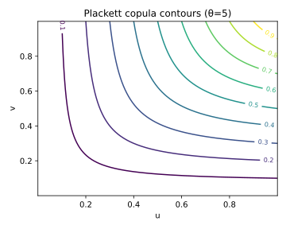
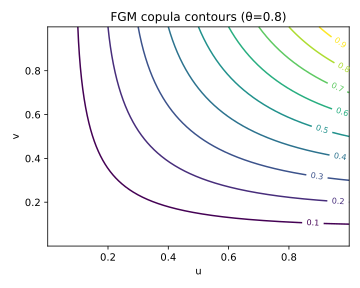

# 10. Miscellaneous Families (Plackett and FGM Copulas)

## 10.1 Context and Motivation
While most practical copulas belong to the **elliptical** or
**Archimedean** families, there exists a set of *miscellaneous copulas*
that, despite their simplicity, play an important role in both
pedagogical and applied contexts.

Two of the most notable are:
- The **Plackett copula**, derived from an odds-ratio construction and
  capable of modeling positive and negative dependence symmetrically.
- The **Farlie–Gumbel–Morgenstern (FGM)** copula, which provides a
  simple polynomial representation of weak dependence.

These families are often used as **baselines** or **analytical test
beds** for calibration procedures, as their closed-form expressions
simplify derivations and Monte Carlo checks.

<!-- Added -->
Unlike the Archimedean class, these copulas **do not arise from a
monotone generator** $\psi(t)$ satisfying the usual Laplace-transform
conditions.  
They violate *total monotonicity* and therefore cannot be expressed as
$C(u,v)=\psi^{-1}(\psi(u)+\psi(v))$.  
This distinction justifies their classification as **non-Archimedean**
but analytically tractable alternatives.
<!-- End Added -->

---

## 10.2 Mathematical Definition

### 10.2.1 Plackett Copula

The **Plackett copula** is defined for $\theta > 0$ as:

$$
C_\theta(u,v)
 = \frac{
    1 + (\theta - 1)(u+v)
    - \sqrt{\big[1 + (\theta - 1)(u+v)\big]^2 - 4uv\theta(\theta - 1)}
   }{
    2(\theta - 1)
   }.
$$

For $\theta = 1$, it reduces to the independence copula $C(u,v)=uv$.

**Density:**

$$
c_\theta(u,v)
 = \frac{
     \theta[1 + (\theta - 1)(u+v - 2uv)]
   }{
     \big[
       (1 + (\theta - 1)(u+v - 2uv))^2
       + 4uv\theta(\theta - 1)
     \big]^{3/2}
   }.
$$

**Parameter range:**
- $\theta = 1$: independence  
- $\theta \to \infty$: comonotonic  
- $\theta \to 0^{+}$: countermonotonic

<!-- Added -->
The Plackett copula can also be viewed as a **logistic-type copula**:
it arises from a constant *odds-ratio model*, linking probabilities via a
logistic dependence parameter $\theta$.  
This formulation explains its symmetric and smoothly varying dependence
around independence.
<!-- End Added -->

---

### 10.2.2 Farlie–Gumbel–Morgenstern (FGM) Copula

The **FGM copula** has the simplest polynomial form:

$$
C_\theta(u,v)
 = uv\,[1 + \theta(1-u)(1-v)], \qquad \theta \in [-1,1].
$$

**Density:**
$$
c_\theta(u,v)
 = 1 + \theta(1 - 2u)(1 - 2v).
$$

FGM captures only *weak dependence* (both positive and negative), with
limited correlation range $|\rho| \le 1/3$.

---

## 10.3 Interpretation and Intuition

### Plackett
The Plackett copula describes symmetric association between variables
through an *odds-ratio mechanism*.  
It can represent both positive and negative dependence continuously via
the parameter $\theta$.  
At moderate values ($1<\theta<5$), it mimics the shape of an elliptical
copula but with a simpler algebraic form.

Its analytical invertibility makes it ideal for stress tests, copula
validation, and fast conditional sampling.

### FGM
The FGM copula represents a **first-order perturbation of independence**:
it modifies the product $uv$ by a bilinear correction term.  
Because of this simplicity, it is useful for:
- Demonstrating the concept of dependence in teaching,
- Serving as a baseline for model validation,
- Testing estimation algorithms.

However, its weak dependence and lack of tail features limit its
real-world applicability.

---

## 10.4 Properties and Remarks

| Copula | Parameter range | Kendall’s τ | Tail dependence | Symmetry | Remarks |
|---------|------------------|--------------|-----------------|-----------|----------|
| **Plackett** | $\theta>0$ | Computed numerically | $\lambda_U=\lambda_L=0$ | Symmetric | Supports both signs of correlation |
| **FGM** | $\theta\in[-1,1]$ | $\tau=\tfrac{2\theta}{9}$ | $\lambda_U=\lambda_L=0$ | Symmetric | Weak dependence, polynomial simplicity |

Both copulas are symmetric and analytically tractable, but **neither
exhibits tail dependence**.  
They serve as analytical references for testing estimation, inversion,
and simulation algorithms under weak association.

<!-- Added -->
These copulas are valuable **benchmark tools** in simulation and
validation studies.  
Their closed forms make them ideal for verifying analytical consistency
and numerical accuracy of more complex copula models.
<!-- End Added -->

---

## 10.5 Illustration

**Figure — Plackett copula density contours (θ=5)**  

The contours show symmetric elliptical shapes for $\theta>1$, similar to
a Gaussian copula but with algebraic simplicity.

**Figure — FGM copula density contours (θ=0.8)**  

The FGM copula contours are nearly linear, illustrating its limited
dependence range.

**Figure — Simulated pseudo-observations**  

Simulated data for Plackett and FGM copulas reveal symmetric clustering
around the diagonal, without concentration near the corners.

---

## 10.6 References

- Plackett, R. L. (1965). *A Class of Bivariate Distributions.*
  *Journal of the American Statistical Association*, 60(310), 516–522.  
- Nelsen, R. B. (2006). *An Introduction to Copulas* (2nd ed.). Springer.  
- Joe, H. (2014). *Dependence Modeling with Copulas.* CRC Press.  
- Farlie, D. J. G. (1960). *The Performance of Some Correlation Coefficients.*
  *Journal of the Royal Statistical Society B*, 22(1), 1–6.  
- Morgenstern, D. (1956). *Einige Eigenschaften der Bivariate Verteilung.*
  *Mathematische Statistik und Wahrscheinlichkeitstheorie.*
