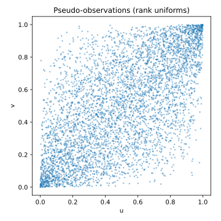
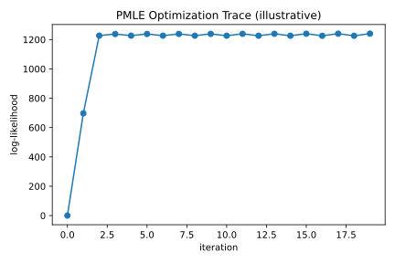

# 1. Pseudo-Maximum Likelihood Estimation (PMLE)

## 1.1 Context and Motivation
The **Pseudo-Maximum Likelihood Estimation (PMLE)** method is the most
widely used approach for calibrating parametric copulas to empirical
data.  
It adapts the classical maximum likelihood principle to situations in
which the true marginal distributions of the variables are unknown but
can be estimated non-parametrically.

The central idea is to transform observed data
$X=(X_1,\dots,X_d)$ into **pseudo-observations**
$U_i=\hat F_i(X_i)\in[0,1]$ using empirical or fitted marginal
distributions $\hat F_i$.  
The copula parameters $\theta$ are then estimated by maximizing the
log-likelihood of the copula density on the transformed data:

$$
\hat\theta
 = \arg\max_{\theta\in\Theta}
   \sum_{t=1}^{n} \log c_\theta(U_{t1},\ldots,U_{td}).
$$

This method preserves the dependence structure while abstracting from
marginal effects, providing consistent estimates under weak assumptions
and excellent numerical stability.  
Unlike the full maximum likelihood approach, PMLE remains valid even
when the marginal models are misspecified, achieving *semiparametric
efficiency* under mild conditions (Tsukahara, 2005). This makes it the
standard benchmark for copula calibration in empirical applications.

---

## 1.2 Mathematical Definition

Let $(X_{t1},\ldots,X_{td})$, $t=1,\dots,n$, be an i.i.d. sample with
continuous marginals $F_1,\ldots,F_d$.  
By Sklar’s theorem, the joint density factorizes as:

$$
f(x_1,\ldots,x_d)
 = c_\theta(F_1(x_1),\ldots,F_d(x_d))
   \prod_{i=1}^{d} f_i(x_i),
$$

where $c_\theta$ is the copula density.

If the marginals $F_i$ are unknown, they can be estimated empirically:

$$
\hat F_i(x)
 = \frac{1}{n+1}\sum_{t=1}^{n}\mathbf{1}(X_{ti}\le x),
$$

which ensures pseudo-observations
$U_{ti}=\hat F_i(X_{ti})\in(0,1)$.

The **pseudo-log-likelihood** function is then defined as

$$
\ell_n(\theta)
 = \sum_{t=1}^{n}\log c_\theta(U_{t1},\ldots,U_{td}),
$$

and the **PMLE estimator** is

$$
\hat\theta_{\text{PMLE}}
 = \arg\max_{\theta\in\Theta}\ell_n(\theta).
$$

In practice, optimization is performed numerically (e.g. L-BFGS-B,
Nelder-Mead, or trust-region methods) using gradients of $\ell_n$ if
available.

### Gradient (score function)

For smooth $c_\theta$:

$$
\nabla_\theta \ell_n(\theta)
 = \sum_{t=1}^{n}
   \frac{\nabla_\theta c_\theta(U_t)}{c_\theta(U_t)}.
$$

Under regularity conditions (identifiability, differentiability,
boundedness), $\hat\theta_{\text{PMLE}}$ is
**consistent** and **asymptotically normal**:

$$
\sqrt{n}(\hat\theta_{\text{PMLE}}-\theta_0)
 \xrightarrow{d}
 \mathcal{N}(0,\,I^{-1}(\theta_0)),
$$

where $I(\theta_0)$ is the Fisher information matrix of the copula
density.  
In the semiparametric framework, PMLE attains the *semiparametric
efficiency bound*, making it asymptotically optimal among all estimators
that do not rely on known marginals.

---

## 1.3 Interpretation and Intuition

PMLE can be viewed as the **likelihood method on the copula layer**:
- Step 1 — Strip away the marginals via rank transformation.  
- Step 2 — Fit the parametric dependence structure $c_\theta$ directly
  on the uniformized data.

This has three intuitive consequences:

1. **Marginal invariance**: only the relative ranks matter.  
2. **Dependence fidelity**: the shape of $c_\theta$ adjusts to capture
   concentration, asymmetry, or tail behavior.  
3. **Unified comparison**: log-likelihood values are directly comparable
   across different copula families on the same pseudo-data.

From a broader perspective, PMLE provides a *link between nonparametric
and parametric inference*: the marginals are estimated freely, while the
dependence structure is modeled parametrically.  
In financial contexts, PMLE corresponds to *calibrating the latent
dependence model given standardized residuals* — an interpretation used
in credit portfolio modeling, systemic risk measurement, and joint
stress testing.

---

## 1.4 Properties and Remarks

| Property | Description | Implication |
|-----------|--------------|-------------|
| **Consistency** | $\hat\theta_{\text{PMLE}}\xrightarrow{p}\theta_0$ under mild conditions | Reliable asymptotics |
| **Efficiency** | Asymptotically efficient if marginals estimated consistently | Nearly optimal variance |
| **Invariance** | Unaffected by monotone marginal transforms | Rank-based robustness |
| **Numerical stability** | Robust for most families, especially elliptical | Ideal for large samples |
| **Limitations** | Sensitive to local optima for multimodal likelihoods | Requires good initialization |
| **Variants** | Smoothed PMLE, penalized PMLE, composite likelihood | Used for high-dimensional copulas |
| **Complexity** | $O(n\,p)$ per likelihood evaluation (with $p=$ #params) | Efficient for moderate $d$ |

Practical PMLE implementations often employ:
- **Analytical gradients** for Gaussian and t-copulas,  
- **Automatic differentiation** for Archimedean families,  
- **Numerical stabilization** through log-sum-exp or Cholesky-based
  evaluation of $\Sigma^{-1}$.  

In applied settings, PMLE is frequently complemented by **initialization
strategies** based on rank correlations (e.g., Kendall’s $\tau$ or
Spearman’s $\rho$ inversion), which accelerate convergence and prevent
local optima — a topic expanded in the next section.

---

## 1.5 Illustration

**Figure — Log-likelihood surface for Gaussian copula (ρ parameter)**  

The surface is concave and unimodal, indicating a unique global maximum
at the true correlation $\rho_0$.

**Figure — Pseudo-observations before and after calibration**  

Rank-transformed data $U_i=\hat F_i(X_i)$ allow the model to focus solely
on dependence, eliminating marginal distortions.

**Figure — Log-likelihood trace during optimization**  

The optimization trajectory illustrates fast convergence under L-BFGS-B
with numerical gradients and shows that early iterations capture most of
the likelihood gain.

---

## 1.6 References

- Genest, C., Ghoudi, K., & Rivest, L.-P. (1995).
  *A Semiparametric Estimation Procedure of Dependence Parameters in
  Multivariate Families of Distributions.*
  *Biometrika*, 82(3), 543–552.  
- Nelsen, R. B. (2006). *An Introduction to Copulas* (2nd ed.). Springer.  
- Joe, H. (2014). *Dependence Modeling with Copulas.* CRC Press.  
- McNeil, A. J., Frey, R., & Embrechts, P. (2015).
  *Quantitative Risk Management.* Princeton University Press.  
- Tsukahara, H. (2005). *Semiparametric Estimation in Copula Models.*
  *The Canadian Journal of Statistics*, 33(3), 357–375.  
- Patton, A. J. (2006). *Modelling Asymmetric Exchange Rate Dependence.*
  *International Economic Review*, 47(2), 527–556.
