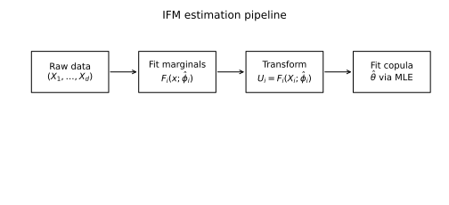
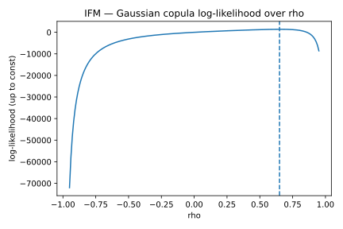
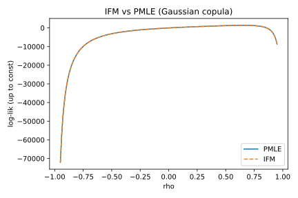

# 2. Inference Functions for Margins (IFM)

## 2.1 Context and Motivation
The **Inference Functions for Margins (IFM)** method is a two-step
likelihood-based estimation approach for parametric copula models.  
Proposed by Joe and Xu (1996), it is designed for situations where both
the marginal distributions and the copula dependence structure have
parametric forms.

Unlike PMLE, which replaces the marginals by empirical CDFs,
the IFM method first estimates the marginal parameters $\hat\phi_i$,
then fits the copula parameters $\hat\theta$ using those estimates.
This separation provides **computational efficiency** and **statistical
stability**, especially in medium to high dimensions.  
Conceptually, it bridges full MLE and semiparametric methods: when both
the marginals and the copula are correctly specified, IFM is nearly as
efficient as joint MLE, but with significantly reduced computational
burden.

---

## 2.2 Mathematical Definition

Let $(X_{t1},\ldots,X_{td})$, $t=1,\ldots,n$, be an i.i.d. sample with
parametric marginals $F_i(x_i;\phi_i)$ and copula $C_\theta$.

### Step 1 — Marginal Estimation

Estimate each $\phi_i$ independently by maximum likelihood:

$$
\hat\phi_i
 = \arg\max_{\phi_i}
   \sum_{t=1}^{n}\log f_i(X_{ti};\phi_i),
$$

where $f_i$ is the marginal density associated with $F_i$.

Obtain pseudo-observations as

$$
\hat U_{ti} = F_i(X_{ti};\hat\phi_i), \qquad i=1,\ldots,d.
$$

### Step 2 — Copula Estimation

Given the pseudo-observations $\hat U_t=(\hat U_{t1},\ldots,\hat U_{td})$,
maximize the copula log-likelihood:

$$
\hat\theta
 = \arg\max_{\theta\in\Theta}
   \sum_{t=1}^{n}\log c_\theta(\hat U_t),
$$

where $c_\theta$ is the copula density.

The resulting **IFM estimator** is
$(\hat\phi_1,\ldots,\hat\phi_d,\hat\theta)$.

---

### Statistical properties

Under standard regularity assumptions (continuity, differentiability,
identifiability), the IFM estimator is:

- **Consistent** and **asymptotically normal**,  
- **Asymptotically efficient** when the true marginals are parametric,  
- Equivalent to **full MLE** if marginals and copula are correctly
  specified.

Let $\eta=(\phi_1,\ldots,\phi_d,\theta)$ denote all parameters and
$\hat\eta=(\hat\phi,\hat\theta)$ the IFM estimate.  
Then:

$$
\sqrt{n}(\hat\eta - \eta_0)
 \xrightarrow{d}
 \mathcal{N}(0,\,I_{\text{IFM}}^{-1}(\eta_0)),
$$

with $I_{\text{IFM}}$ a block-diagonal approximation of the Fisher
information.  
The efficiency loss relative to full MLE arises from ignoring the
cross-information terms between marginals and copula parameters, but
this difference vanishes asymptotically as $n\to\infty$.

---

## 2.3 Interpretation and Intuition

The IFM procedure can be seen as a **hierarchical likelihood**
approximation:

1. Marginal parameters $\phi_i$ govern the univariate behavior.  
2. Copula parameters $\theta$ govern dependence conditional on the
   standardized marginals.

The two-step nature provides several advantages:
- **Computational tractability:** estimation scales linearly with $d$ in
  the first step.  
- **Parallelization:** marginals can be fitted independently.  
- **Interpretability:** separate calibration of individual risk factors
  before estimating joint dependence.  

From a conceptual standpoint, IFM corresponds to assuming the marginals
are known up to parametric form and treating the copula layer as a
conditional model.  
This makes IFM particularly attractive for financial applications where
each asset or factor can be modeled individually (e.g., Student-t or
skewed distributions), and dependence is introduced only at the copula
level.

For example, in credit or market risk modeling, one may first fit
univariate Student-t distributions to asset returns and then estimate a
Gaussian or t-copula to capture the dependence across portfolios.

---

## 2.4 Properties and Remarks

| Property | Description | Implication |
|-----------|--------------|-------------|
| **Consistency** | Consistent if marginals and copula are correctly specified | Theoretical validity |
| **Efficiency** | Slightly less efficient than joint MLE; nearly equivalent asymptotically | Small efficiency loss |
| **Decomposition** | Stepwise likelihood maximization | Modular estimation |
| **Robustness** | Sensitive to mis-specification of marginals | Use with validated marginals |
| **Scalability** | Excellent; $O(nd)$ marginal fits + $O(np)$ copula fit | Efficient in high-d |
| **Initialization** | Independent from PMLE, useful for warm starts | Often used as pre-step |
| **Variants** | Semi-parametric IFM (empirical marginals) | Hybrid extension |
| **Implementation** | Uses log-likelihood aggregation across marginals and copula | Compatible with modular code |

A practical refinement known as the **semi-parametric IFM** uses
empirical CDFs for the marginals while keeping the parametric copula,
combining the flexibility of PMLE with the structure of IFM.  
This variant is especially useful when marginal models are uncertain but
the dependence structure is well defined.

---

## 2.5 Illustration

**Figure — IFM estimation pipeline**  

The pipeline summarizes the two-step process: marginal calibration
(first stage) followed by copula fitting on the transformed uniforms.

**Figure — Gaussian copula IFM surface**  

The log-likelihood surface resembles that of PMLE, confirming numerical
stability and global concavity for elliptical copulas.

**Figure — Comparison between IFM and PMLE estimates**  

For large samples, both estimators coincide closely.  
Differences appear primarily when marginal models are mis-specified or
sample size is small.

---

## 2.6 References

- Joe, H., & Xu, J. J. (1996).
  *The Estimation Method of Inference Functions for Margins for
  Multivariate Models.*
  *Technical Report 166*, University of British Columbia.  
- Nelsen, R. B. (2006). *An Introduction to Copulas* (2nd ed.). Springer.  
- Joe, H. (2014). *Dependence Modeling with Copulas.* CRC Press.  
- McNeil, A. J., Frey, R., & Embrechts, P. (2015).
  *Quantitative Risk Management.* Princeton University Press.  
- Patton, A. J. (2006).
  *Modelling Asymmetric Exchange Rate Dependence.*
  *International Economic Review*, 47(2), 527–556.  

---

While IFM retains the theoretical rigor of MLE, its stepwise
decomposition makes it ideal for practical calibration workflows.  
The next section introduces a complementary **moment-based estimator**,
the *τ-inversion method*, which bypasses optimization entirely by
matching the empirical and theoretical Kendall’s τ.
