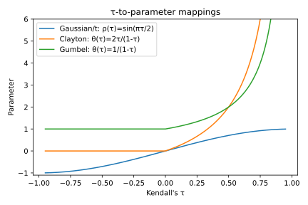
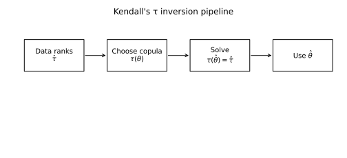
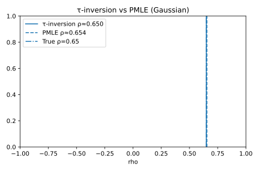

# 3. Method of Moments — Kendall’s τ Inversion

## 3.1 Context and Motivation
The **τ-inversion method** (method of moments based on Kendall’s τ) is a
closed-form or semi-closed-form estimator for the dependence parameter
of a copula.  
It leverages the analytical relationship between **Kendall’s rank
correlation τ** and the copula parameter θ.  

This approach is conceptually simple, computationally efficient, and
free of optimization: it estimates θ by matching the theoretical τ(θ)
of the copula family to the empirical $\hat\tau$ obtained from the data.

Because of its speed and robustness, τ-inversion is widely used for:
- initializing numerical optimization in PMLE or IFM,  
- quick dependence diagnostics,  
- or rough calibration in large-scale Monte Carlo or stress-testing
  environments.  

It provides an interpretable, rank-based alternative to likelihood
methods and is particularly useful when the sample size is large or
computational constraints make full optimization impractical.

---

## 3.2 Mathematical Definition

Let $(X_{t1},X_{t2})$, $t=1,\dots,n$, be i.i.d. observations with
continuous marginals.  
Let $\hat\tau$ denote the **sample Kendall’s τ**, defined as

$$
\hat\tau
 = \frac{2}{n(n-1)}
   \sum_{1\le i < j \le n}
   \text{sign}\!\big((X_{i1}-X_{j1})(X_{i2}-X_{j2})\big).
$$

For a copula $C_\theta(u,v)$ with theoretical τ given by
$\tau(\theta)$, the **τ-inversion estimator** is

$$
\hat\theta_{\tau}
 = \tau^{-1}(\hat\tau),
$$

where $\tau^{-1}$ denotes the functional inverse of τ(θ).

When τ(θ) has a known closed-form expression (as for most Archimedean
and elliptical copulas), the inversion is direct.  
Otherwise, θ is obtained by solving the scalar equation:

$$
\tau(\theta) - \hat\tau = 0
$$

numerically, e.g. via Newton–Raphson or Brent’s method.

---

### Analytical relationships τ(θ)

| Copula family | Relationship | Inversion |
|----------------|--------------|------------|
| **Gaussian / t** | $\tau = \tfrac{2}{\pi}\arcsin(\rho)$ | $\rho = \sin\!\left(\tfrac{\pi\tau}{2}\right)$ |
| **Clayton** | $\tau = \tfrac{\theta}{\theta+2}$ | $\theta = \tfrac{2\tau}{1-\tau}$ |
| **Gumbel** | $\tau = 1 - \tfrac{1}{\theta}$ | $\theta = \tfrac{1}{1-\tau}$ |
| **Frank** | $\tau = 1 - \tfrac{4}{\theta}\!\left(1 - \tfrac{D_1(\theta)}{\theta}\right)$ | numerical inversion via Debye $D_1$ |
| **Joe** | $\tau = 1 - 4\!\sum_{k=1}^{\infty}\frac{1}{k(\theta k + 2)(\theta(k+1)+2)}$ | numerical series inversion |

> **Note.** A similar approach can be derived using **Spearman’s ρ**, with
> $\rho(\theta)$ replacing τ(θ). However, Kendall’s τ is often preferred
> because it depends solely on the copula and admits closed-form
> expressions for most common families.

---

## 3.3 Interpretation and Intuition

Kendall’s τ measures the *probability of concordance minus discordance*:

$$
\tau = P\big[(X_1 - X'_1)(X_2 - X'_2) > 0\big]
     - P\big[(X_1 - X'_1)(X_2 - X'_2) < 0\big].
$$

It is invariant under monotone transformations of the marginals, making
it ideal for copula-based dependence modeling.  
Since τ depends solely on the copula $C_\theta$, it provides a natural
moment condition linking empirical concordance to theoretical parameter
values.

The intuition behind τ-inversion is straightforward:
- Compute $\hat\tau$ empirically from the data (rank-based).  
- Find θ such that the theoretical τ(θ) of the chosen copula equals
  $\hat\tau$.  

The resulting $\hat\theta$ captures the global strength of dependence in
a single scalar statistic, without evaluating any likelihood or density.

From a **geometric viewpoint**, Kendall’s τ can be interpreted as the
normalized area between the empirical copula $\hat C_n(u,v)$ and the
independence copula $C_\perp(u,v)=uv$.  
Thus, τ-inversion essentially identifies the copula parameter whose
theoretical shape produces the same level of global concordance as
observed in the data.

This makes τ-inversion a **fast, robust, and interpretable** estimator,
especially suitable for initialization of more complex estimators like
PMLE or IFM.

---

## 3.4 Properties and Remarks

| Property | Description | Implication |
|-----------|--------------|-------------|
| **Consistency** | $\hat\theta_{\tau}\xrightarrow{p}\theta_0$ under regularity conditions | Statistically valid |
| **Efficiency** | Less efficient than PMLE or IFM | Used for initialization |
| **Invariance** | Independent of monotone transforms of marginals | Rank-based robustness |
| **Computation** | Closed-form for most families; scalar root for others | Extremely fast |
| **Asymptotic variance** | Derivable via Delta method from var($\hat\tau$) | Analytical uncertainty |
| **Bias** | Slight positive bias in small samples | Negligible for $n>100$ |
| **Usage** | Common as warm-start for MLE routines | Improves convergence stability |

### Asymptotic variance (sketch)
If $\sqrt{n}(\hat\tau - \tau(\theta_0)) \to \mathcal{N}(0, \sigma_\tau^2)$,
then by the Delta method:

$$
\sqrt{n}(\hat\theta_\tau - \theta_0)
 \xrightarrow{d}
 \mathcal{N}\!\left(
   0,\,
   \frac{\sigma_\tau^2}{
     [\tau'(\theta_0)]^2
   }
 \right).
$$

This provides a simple analytical form for uncertainty quantification.

In practice, $\hat\theta_\tau$ offers reliable starting points for
numerical likelihood optimization and can dramatically reduce the
number of iterations required by PMLE or IFM routines.

---

## 3.5 Illustration

**Figure — Relationship between τ and copula parameters**  

This plot shows the monotonic mapping τ(θ) for several copula families,
highlighting its invertibility.

**Figure — τ-inversion estimation process**  

The pipeline illustrates the steps: compute $\hat\tau$ from ranks, find
θ such that τ(θ)=τ̂, and use θ̂ as calibration output or initialization.

**Figure — Comparison of τ-inversion and PMLE estimates (Monte Carlo)**  

In large samples, τ-inversion and PMLE estimates coincide closely.
Differences emerge in small samples or non-elliptical settings.

---

## 3.6 References

- Genest, C., & Rivest, L.-P. (1993).
  *Statistical Inference Procedures for Bivariate Archimedean Copulas.*
  *Journal of the American Statistical Association*, 88(423), 1034–1043.  
- Nelsen, R. B. (2006). *An Introduction to Copulas* (2nd ed.). Springer.  
- Joe, H. (2014). *Dependence Modeling with Copulas.* CRC Press.  
- McNeil, A. J., Frey, R., & Embrechts, P. (2015).
  *Quantitative Risk Management.* Princeton University Press.  
- Kendall, M. (1938). *A New Measure of Rank Correlation.*
  *Biometrika*, 30(1/2), 81–93.  

---

Kendall’s τ inversion thus offers a simple yet powerful foundation for
dependence estimation.  
While it prioritizes interpretability and computational speed over
efficiency, its analytical tractability makes it an indispensable tool
for exploratory analysis and model initialization.  
The next section extends the idea from *moment matching* to *distribution
matching*, introducing the **Minimum Distance Estimation (CvM)** method.
