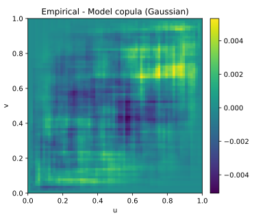

# 4. Minimum Distance Estimation — Cramér–von Mises (CvM)

## 4.1 Context and Motivation
The **Minimum Distance Estimation (MDE)** approach estimates copula
parameters by minimizing a distance between the **empirical copula**
$\hat C_n$ and the **theoretical copula** $C_\theta$.  
Among the various metrics available, the **Cramér–von Mises (CvM)**
criterion is one of the most popular due to its **stability,
interpretability, and smoothness**.

This method is non-likelihood-based and therefore **robust to model
mis-specification** and **outliers**.  
It measures the global discrepancy between empirical dependence and
model-implied dependence.

Formally, MDE minimizes the squared $L^2$-distance:

$$
\hat\theta_{\text{CvM}}
 = \arg\min_{\theta\in\Theta}
   \int_{[0,1]^d}
   \big[\hat C_n(u) - C_\theta(u)\big]^2
   w(u)\,du,
$$

where $w(u)$ is a weight function (typically uniform).  
In practice, the integral is approximated using the sample pseudo-
observations.  

This approach belongs to the general class of **minimum distance
estimators** introduced by *Wolfowitz (1957)*, later developed within
empirical process theory.  
In the context of copulas, it provides a natural way to measure global
goodness-of-fit across the dependence surface rather than through local
density behavior.

---

## 4.2 Mathematical Definition

Given pseudo-observations
$U_t=(U_{t1},\ldots,U_{td})$, $t=1,\dots,n$,
the **empirical copula** is defined as

$$
\hat C_n(u)
 = \frac{1}{n}\sum_{t=1}^{n}
   \mathbf{1}(U_{t1}\le u_1,\ldots,U_{td}\le u_d).
$$

The **Cramér–von Mises objective** becomes

$$
S_n(\theta)
 = \int_{[0,1]^d}
   \big[\hat C_n(u) - C_\theta(u)\big]^2\,du.
$$

A consistent discrete approximation is obtained via

$$
S_n(\theta)
 \approx \frac{1}{n}\sum_{t=1}^{n}
   \big[\hat C_n(U_t) - C_\theta(U_t)\big]^2.
$$

The **MDE (CvM) estimator** is thus:

$$
\hat\theta_{\text{CvM}}
 = \arg\min_{\theta\in\Theta} S_n(\theta).
$$

In the bivariate case, $S_n(\theta)$ is smooth and convex for most
copula families, enabling reliable gradient-free optimization.

---

### Relation to other estimators

- PMLE maximizes the fit to the copula **density**.  
- MDE minimizes the global discrepancy of the **cumulative function**.  
- τ-inversion matches a **scalar moment** (Kendall’s τ).  

Hence, MDE can be seen as an **intermediate approach** — global yet
non-likelihood-based, robust but still statistically consistent.

---

## 4.3 Interpretation and Intuition

The Cramér–von Mises criterion evaluates how well the **shape of the
empirical dependence surface** matches that implied by the copula model.  
It is sensitive to differences across the entire unit cube rather than
only local likelihood peaks.

Intuitively:
- For a perfect model fit, $\hat C_n(u)\approx C_\theta(u)$ everywhere,
  yielding $S_n(\theta)\to0$.  
- Larger deviations reflect misfit in joint tail or central regions.  
- The weighting function $w(u)$ can emphasize particular regions (e.g.
  tails or median dependence).

Because MDE relies on **empirical distribution functions**, it is
naturally robust to misspecification of marginals and can be used for
**diagnostic validation** as well as estimation.  
This property makes it especially useful in risk modeling, where
outliers and heavy tails often distort likelihood-based estimators.

From the standpoint of **empirical process theory**, MDE minimizes a
distance between the empirical process $\sqrt{n}(\hat C_n - C_\theta)$
and its theoretical limit, leading to asymptotic normality and providing
a foundation for goodness-of-fit testing.

---

## 4.4 Properties and Remarks

| Property | Description | Implication |
|-----------|--------------|-------------|
| **Consistency** | $\hat\theta_{\text{CvM}}\xrightarrow{p}\theta_0$ if $C_\theta$ identifiable | Reliable asymptotics |
| **Efficiency** | Lower than PMLE; robust trade-off | Global goodness-of-fit focus |
| **Computation** | Requires numerical integration or sample approximation | $O(n\,p)$ feasible |
| **Weighting** | $w(u)\equiv1$ (uniform) or tail-weighted alternatives | Can target tail fit |
| **Invariance** | Rank-based; invariant to monotone transformations | Same robustness as PMLE |
| **Diagnostic use** | Residual $S_n(\hat\theta)$ used for GoF testing | Key for model validation |
| **Variants** | CvM, KS, Anderson–Darling distances | Different sensitivity profiles |

### Link to goodness-of-fit testing
The minimized distance $S_n(\hat\theta)$ can be used as a test statistic
for copula adequacy:

$$
T_n = n\,S_n(\hat\theta),
$$

whose null distribution can be approximated by multiplier bootstrap
methods (Genest & Rémillard, 2008).  
Large $T_n$ values indicate poor model fit.

From a practical standpoint, this allows MDE to serve a **dual purpose**:
parameter estimation and model validation, within the same framework.

---

## 4.5 Illustration

**Figure — Empirical vs model copula surfaces (Gaussian)**  

The empirical surface $\hat C_n(u,v)$ and the fitted copula
$C_\theta(u,v)$ show high concordance for well-calibrated models.

**Figure — Cramér–von Mises distance landscape**  

The surface $S_n(\theta)$ exhibits a smooth convex shape with a unique
minimum near the true parameter.

**Figure — Residual diagnostics after CvM calibration**  

Residual plots visualize localized deviations between $\hat C_n$ and
$C_{\hat\theta}$ across the unit square — useful for model validation
and tail-fit diagnostics.

---

## 4.6 References

- Genest, C., Rémillard, B., & Beaudoin, D. (2009).
  *Goodness-of-Fit Tests for Copulas: A Review and a Power Study.*
  *Insurance: Mathematics and Economics*, 44(2), 199–213.  
- Genest, C., & Rémillard, B. (2008).
  *Validity of the Parametric Bootstrap for Goodness-of-Fit Testing in
  Semiparametric Models.*
  *Annales de l’Institut Henri Poincaré*, 44(6), 1096–1127.  
- Nelsen, R. B. (2006). *An Introduction to Copulas* (2nd ed.). Springer.  
- Joe, H. (2014). *Dependence Modeling with Copulas.* CRC Press.  
- Rémillard, B. (2010). *Goodness-of-Fit Tests for Copulas.*
  In *Copula Theory and Its Applications*, Springer Lecture Notes.  
- Wolfowitz, J. (1957).
  *Minimum Distance Estimation of the Parameters of a Distribution.*
  *Annals of Mathematical Statistics*, 28(1), 75–88.  

---

The Cramér–von Mises estimator complements the previous methods by
focusing on **distributional fidelity** rather than local likelihood
fit.  
Its robustness and interpretability make it an appealing choice for
model validation and dependence diagnostics, especially in empirical
finance and risk analysis.  
Together, PMLE, IFM, τ-inversion, and CvM form a unified toolkit for
copula calibration — spanning likelihood, moment, and distance-based
approaches.
