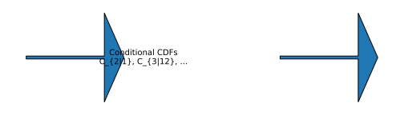
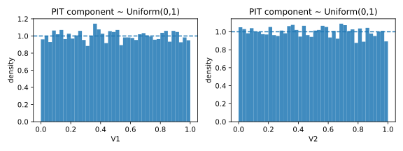
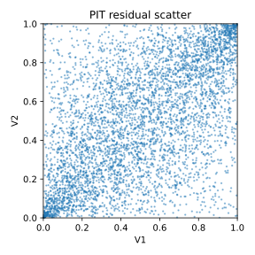

# 1. Rosenblatt Transform and Probability Integral Transform (PIT)

## 1.1 Context and Motivation
After parameter calibration via methods such as PMLE or MDE, a copula
model must be verified to ensure that it accurately captures the
dependence structure of the data.  
The **Rosenblatt transform**, also known as the **multivariate
Probability Integral Transform (PIT)**, provides a fundamental
diagnostic tool for this purpose.

If the fitted copula $C_{\hat\theta}$ is correct, then the transformed
variables obtained from its conditional distributions should be
**independent and uniformly distributed** on $[0,1]^d$.

This property allows direct testing of model adequacy, revealing whether
residual dependence remains after calibration.  
In practice, empirical pseudo-observations are used together with
analytical partial derivatives of $C_\theta$, enabling the computation
of Rosenblatt residuals for each observation.

---

## 1.2 Mathematical Definition

Let $C_\theta$ be a $d$-dimensional copula with density $c_\theta$.  
For an observation $U=(U_1,\ldots,U_d)\in[0,1]^d$, the **Rosenblatt
transform** is defined recursively as:

$$
\begin{aligned}
V_1 &= U_1, \\
V_2 &= C_{2|1}(U_2\,|\,U_1;\theta)
     = \frac{\partial C_\theta(U_1,U_2)}{\partial U_1}, \\
V_3 &= C_{3|12}(U_3\,|\,U_1,U_2;\theta), \\
&\ \vdots \\
V_d &= C_{d|1,\ldots,d-1}(U_d\,|\,U_1,\ldots,U_{d-1};\theta).
\end{aligned}
$$

Under the true copula $C_{\theta_0}$, the transformed vector
$V=(V_1,\ldots,V_d)$ satisfies

$$
V \sim \text{Uniform}[0,1]^d,
\quad \text{and} \quad V_1,\ldots,V_d \text{ independent.}
$$

In the **empirical version**, $\hat C_{\hat\theta}$ replaces $C_\theta$,
using the estimated parameters from calibration.

---

### Example (bivariate case)

For $d=2$:

$$
\begin{aligned}
V_1 &= U_1, \\
V_2 &= C_{2|1}(U_2|U_1;\hat\theta)
     = \frac{\partial C_{\hat\theta}(U_1,U_2)}{\partial U_1}.
\end{aligned}
$$

If the model is correct, $(V_1,V_2)$ should be uniformly distributed on
$[0,1]^2$ and show no residual dependence.

---

## 1.3 Interpretation and Intuition

The Rosenblatt transform sequentially “removes” dependence:
each conditional CDF normalizes one variable given all previous ones.
If the fitted copula perfectly describes the joint dependence, the
transform destroys any residual association, leaving purely independent
uniforms.

Intuitively:
- A perfect fit ⇒ Rosenblatt outputs resemble white noise.  
- Poor fit ⇒ residual clustering or non-uniform patterns.  

Graphical checks and uniformity tests (e.g., Kolmogorov–Smirnov,
Anderson–Darling) can then be applied on $(V_1,\ldots,V_d)$ to detect
misfit.  
For higher dimensions, additional independence tests (e.g., energy or
HSIC tests) can be applied to the transformed vector.

This makes the transform a **universal diagnostic** for copula adequacy
and the foundation for subsequent GoF analyses.

---

## 1.4 Properties and Remarks

| Property | Description | Implication |
|-----------|--------------|-------------|
| **Uniformity** | $V_i \sim U(0,1)$ under correct model | Direct goodness-of-fit criterion |
| **Independence** | Components of $V$ independent | Absence of residual structure |
| **Invertibility** | $C_\theta$ ↔ Rosenblatt transform bijection | Enables simulation and inversion |
| **Order dependence** | Depends on variable ordering | Must fix or randomize order |
| **Computational form** | Requires partial derivatives of $C_\theta$ | Closed-form for most families |
| **Diagnostic use** | Enables PIT histograms, QQ-plots, uniformity tests | Core validation tool |
| **Limitations** | Sensitive to tail misfit; requires accurate parameter estimates | Complement with GoF tests |

---

## 1.5 Illustration

**Figure — Rosenblatt transform pipeline**  

Sequential transformation of pseudo-observations to uniform residuals.

**Figure — PIT histograms under correct and incorrect models**  

Histograms of PIT components $V_i$ under correct (flat) and misspecified
(curved) models illustrate the sensitivity of the test.

**Figure — Residual dependence scatter after PIT**  

Under the correct model, $(V_1,V_2)$ scatter uniformly; patterns or
diagonal clustering indicate misspecification.

---

## 1.6 References

- Rosenblatt, M. (1952). *Remarks on a Multivariate Transformation.*
  *Annals of Mathematical Statistics*, 23(3), 470–472.  
- Genest, C., Rémillard, B., & Beaudoin, D. (2009).
  *Goodness-of-Fit Tests for Copulas: A Review and a Power Study.*
  *Insurance: Mathematics and Economics*, 44(2), 199–213.  
- Joe, H. (2014). *Dependence Modeling with Copulas.* CRC Press.  
- Nelsen, R. B. (2006). *An Introduction to Copulas* (2nd ed.). Springer.  
- Rémillard, B. (2010). *Goodness-of-Fit Tests for Copulas.*
  In *Copula Theory and Its Applications*, Springer Lecture Notes.
