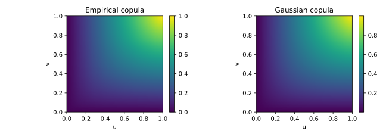
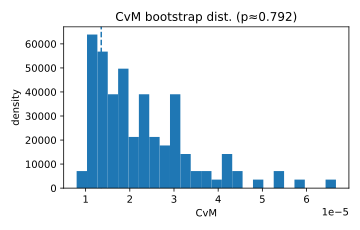
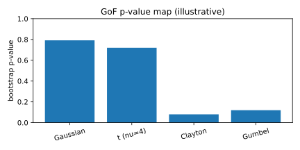

# 2. Goodness-of-Fit Tests — Kolmogorov–Smirnov (KS) and Cramér–von Mises (CvM)

## 2.1 Context and Motivation
Once a copula model has been calibrated, it is essential to assess
whether the fitted copula $C_{\hat\theta}$ adequately represents the
true dependence structure of the data.  
**Goodness-of-fit (GoF) tests** provide formal statistical procedures for
this purpose.

The two most widely used GoF criteria are based on the **Kolmogorov–
Smirnov (KS)** and **Cramér–von Mises (CvM)** distances between the
empirical copula $\hat C_n$ and the fitted copula $C_{\hat\theta}$.

These tests complement the **Rosenblatt/PIT diagnostics**, which provide
visual and qualitative evidence of adequacy, by offering **quantitative,
replicable validation metrics** suitable for model validation reports,
statistical audits, and regulatory documentation.

---

## 2.2 Mathematical Definition

Let $\hat C_n$ be the empirical copula:

$$
\hat C_n(u)
 = \frac{1}{n}\sum_{t=1}^{n}
   \mathbf{1}(U_{t1}\le u_1,\ldots,U_{td}\le u_d),
$$

and let $C_{\hat\theta}$ denote the fitted theoretical copula.

### Kolmogorov–Smirnov statistic

$$
T_{n,\text{KS}}
 = \sup_{u\in[0,1]^d}
   \big|\hat C_n(u) - C_{\hat\theta}(u)\big|.
$$

It measures the **maximum absolute deviation** between empirical and
model copula surfaces.

### Cramér–von Mises statistic

$$
T_{n,\text{CvM}}
 = n \int_{[0,1]^d}
   \big[\hat C_n(u) - C_{\hat\theta}(u)\big]^2\,du.
$$

It quantifies the **integrated squared discrepancy**, weighting all
regions equally (unless modified by a weight function $w(u)$).

### Weighted variants
Weights can be introduced to emphasize regions such as the tails:

$$
T_{n,\text{CvM},w}
 = n \int_{[0,1]^d}
   \big[\hat C_n(u) - C_{\hat\theta}(u)\big]^2 w(u)\,du,
$$

with, e.g., $w(u) = [u(1-u)]^{-1}$ for the **Anderson–Darling** version.

---

## 2.3 Interpretation and Intuition

The KS and CvM tests evaluate the **global fit** between the empirical
and model-implied dependence structures.

- **KS** detects *local* mismatches (sharp peaks or edges).  
- **CvM** captures *global* discrepancies across the unit hypercube.  
- Both tests compare the full dependence surface rather than individual
  pairwise moments or tail coefficients.

In practice:
- Small values of $T_{n,\text{KS}}$ and $T_{n,\text{CvM}}$ imply
  excellent fit.  
- Large values suggest structural misspecification (e.g., incorrect
  tail dependence, asymmetry, or copula family).

These statistics are interpreted via **bootstrap p-values**, since their
exact null distributions depend on the fitted copula.  
While the Rosenblatt transform provides qualitative intuition, these
tests offer **formal quantitative confirmation**.

For dimensions $d>3$, both statistics can lose power due to the
curse of dimensionality; pair-copula or vine-based decompositions
are often preferred in practice.

---

## 2.4 Properties and Remarks

| Property | Description | Implication |
|-----------|--------------|-------------|
| **Null hypothesis** | $H_0: C_{\hat\theta}=C_0$ (model correct) | Baseline adequacy |
| **Alternative** | $H_1:$ model misspecified | Detects dependence errors |
| **Statistic type** | KS: sup-norm; CvM: $L^2$ norm | Complementary sensitivities |
| **Distribution under $H_0$** | Non-standard; estimated via parametric bootstrap | Model-dependent p-value |
| **Bootstrap method** | Simulate data from $C_{\hat\theta}$, re-estimate, recompute statistic | Provides empirical reference |
| **Consistency** | Both tests consistent against all fixed alternatives | Valid asymptotics |
| **Sensitivity** | CvM more robust; KS more sensitive to local peaks | Combine both for auditing |
| **Extensions** | Weighted CvM (Anderson–Darling), rank-based variants | Flexible diagnostics |
| **Practical note** | Parametric bootstrap preferred to multiplier bootstrap in parametric copulas | Higher stability in small samples |

---

### Bootstrap algorithm (parametric)

1. **Fit** $C_{\hat\theta}$ to the data.  
2. **Compute** $T_n$ (KS or CvM) on observed pseudo-observations.  
3. **Repeat** for $B$ bootstrap samples simulated from
   $C_{\hat\theta}$:  
   - Refit $\hat\theta^{*(b)}$;  
   - Compute $T_n^{*(b)}$ for each.  
4. **Approximate p-value:**

$$
p = \frac{1}{B}\sum_{b=1}^{B}
    \mathbf{1}(T_n^{*(b)} \ge T_n).
$$

Reject $H_0$ if $p<\alpha$ (typically $\alpha=0.05$).

---

## 2.5 Illustration

**Figure — Empirical vs model copula surfaces**  

Visual comparison between $\hat C_n(u,v)$ and $C_{\hat\theta}(u,v)$.
Deviations indicate local or global misfit regions.

**Figure — Bootstrap distribution of $T_{n,\text{CvM}}$**  

Histogram of bootstrap replications with observed statistic (vertical
line). A right-shifted observed value indicates rejection of $H_0$.

**Figure — p-value map across copula families**  

Comparative p-values for different copula families on the same dataset
help identify the most appropriate dependence model.

---

## 2.6 References

- Genest, C., Rémillard, B., & Beaudoin, D. (2009).
  *Goodness-of-Fit Tests for Copulas: A Review and a Power Study.*
  *Insurance: Mathematics and Economics*, 44(2), 199–213.  
- Genest, C., & Rémillard, B. (2008).
  *Validity of the Parametric Bootstrap for Goodness-of-Fit Testing in
  Semiparametric Models.*
  *Annales de l’Institut Henri Poincaré*, 44(6), 1096–1127.  
- Kojadinovic, I., & Yan, J. (2011).
  *A Goodness-of-Fit Test for Multivariate Distributions Based on
  Copulas.*
  *Computational Statistics & Data Analysis*, 55(1), 85–96.  
- Nelsen, R. B. (2006). *An Introduction to Copulas* (2nd ed.). Springer.  
- Rémillard, B. (2010). *Goodness-of-Fit Tests for Copulas.*
  In *Copula Theory and Its Applications*, Springer Lecture Notes.

