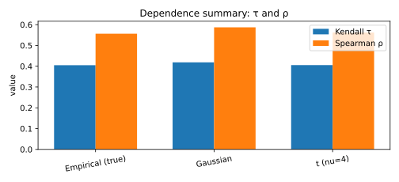
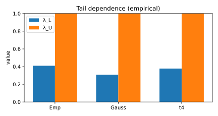
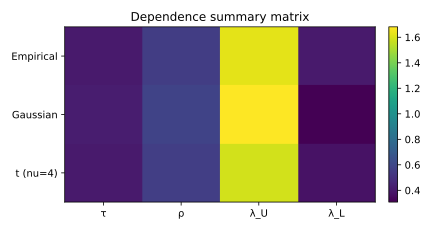

# 3. Dependence Summaries and Diagnostic Metrics

## 3.1 Context and Motivation
Dependence summaries provide a concise statistical description of the
dependence captured by a fitted copula model.  
After calibration and goodness-of-fit evaluation, these metrics allow
direct comparison between **empirical** and **model-implied**
dependence, helping to assess whether the fitted copula reproduces the
observed data structure.

The most common dependence measures derived from a copula $C_\theta$ are:
- **Kendall’s τ** — concordance probability,
- **Spearman’s ρ** — rank correlation,
- **Tail dependence coefficients** $(\lambda_U, \lambda_L)$ — extremal
  co-movement probabilities.

Together, they provide an interpretable summary of both **overall**
and **tail-specific** association, forming the basis of validation
reports and stress-test consistency checks.

---

## 3.2 Mathematical Definition

### Kendall’s τ
Kendall’s τ for a copula $C_\theta$ is defined as

$$
\tau(\theta)
 = 4 \int_{[0,1]^2} C_\theta(u,v)\,dC_\theta(u,v) - 1.
$$

Empirically:

$$
\hat\tau
 = \frac{2}{n(n-1)}\!
   \sum_{1\le i<j\le n}
   \text{sign}\!\big((U_{i1}-U_{j1})(U_{i2}-U_{j2})\big).
$$

Kendall’s τ measures the *probability of concordance minus discordance*
and reflects **global monotonic dependence**.

---

### Spearman’s ρ
Spearman’s rank correlation is

$$
\rho_S(\theta)
 = 12\!\int_{[0,1]^2}\!\! C_\theta(u,v)\,du\,dv - 3.
$$

Empirical counterpart:

$$
\hat\rho_S
 = 12\!\int_{[0,1]^2}\!\! \hat C_n(u,v)\,du\,dv - 3
 = 1 - \frac{6}{n(n^2-1)}
   \sum_{t=1}^{n}(r_{t1}-r_{t2})^2,
$$

where $r_{ti}$ are the ranks of $X_i$.

Spearman’s ρ measures *monotone association strength* and is less
sensitive to extremes than Kendall’s τ.

---

### Tail dependence coefficients

For upper- and lower-tail dependence, respectively:

$$
\lambda_U
 = \lim_{u\to1^{-}}
   P(U_2>u \mid U_1>u)
 = \lim_{u\to1^{-}}
   \frac{1-2u+C_\theta(u,u)}{1-u},
$$

$$
\lambda_L
 = \lim_{u\to0^{+}}
   P(U_2\le u \mid U_1\le u)
 = \lim_{u\to0^{+}}
   \frac{C_\theta(u,u)}{u}.
$$

Empirically, these can be estimated as:

$$
\hat\lambda_U
 = 2 - \frac{\#\{U_{t1}>q_U, U_{t2}>q_U\}}{\#\{U_{t1}>q_U\}},
\quad q_U\approx0.95,
$$

and similarly for $\hat\lambda_L$ with $q_L\approx0.05$.

---

## 3.3 Interpretation and Intuition

Each measure captures a **different aspect** of dependence:

| Measure | Captures | Robustness | Sensitivity |
|----------|-----------|-------------|--------------|
| **τ** | Global concordance | High | Moderate |
| **ρ** | Rank-based correlation | Moderate | Less to tails |
| **λ** | Tail co-movement | Low | High |

Together they provide a comprehensive picture:

- **τ and ρ** quantify overall association strength and sign.  
- **λ_U and λ_L** detect asymmetric co-extremes.  
- Discrepancies between empirical and model values reveal model
  deficiencies (e.g., underestimated tail risk or incorrect asymmetry).

Although defined here for bivariate copulas, analogous multivariate
extensions (e.g., pairwise Kendall matrices or Blomqvist’s β) can be
used in higher dimensions.

---

### Validation principle
A copula passes diagnostic consistency if:

$$
|\hat\tau - \tau(\hat\theta)| < \epsilon_\tau,\quad
|\hat\rho_S - \rho_S(\hat\theta)| < \epsilon_\rho,\quad
|\hat\lambda_U - \lambda_U(\hat\theta)| < \epsilon_\lambda,
$$

for tolerances $\epsilon$ defined by sampling variability or bootstrap
intervals.  
Bootstrap confidence intervals for these measures can be used to assess
statistical significance and uncertainty.

---

## 3.4 Properties and Remarks

| Property | Description | Implication |
|-----------|--------------|-------------|
| **Invariance** | Unaffected by monotone marginal transformations | Pure dependence metrics |
| **Interpretability** | τ, ρ ∈ [−1,1], λ ∈ [0,1] | Dimensionless comparison |
| **Asymptotic link** | $\rho_S \approx \tfrac{3}{2}\tau$ for many families | Approximate redundancy; τ often suffices |
| **Family dependence** | τ(θ), ρ(θ), λ(θ) vary per copula type | Analytical consistency check |
| **Empirical bias** | Slight downward bias in small $n$ | Correct via bootstrap |
| **Usage** | Validation summaries, calibration consistency tables | Quantitative reporting |
| **Extension** | Multivariate and tail-asymmetric extensions exist | Applicable beyond bivariate setting |

These metrics provide the **numerical backbone** of diagnostic tables
and comparative plots across copula families in validation reports.
They are typically reported in model validation dashboards and used to
confirm that fitted copulas reproduce empirical concordance and
tail co-movements.

---

## 3.5 Illustration

**Figure — Empirical vs model τ and ρ**  

Bar comparison between empirical and model-implied dependence measures.

**Figure — Tail dependence comparison (λU, λL)**  

Visual alignment between estimated and theoretical tail coefficients
indicates the accuracy of extremal fit.

**Figure — Dependence summary matrix**  

Matrix visualization summarizing $(\tau,\rho_S,\lambda_U,\lambda_L)$
for multiple fitted copula families.

---

## 3.6 References

- Nelsen, R. B. (2006). *An Introduction to Copulas* (2nd ed.). Springer.  
- Joe, H. (2014). *Dependence Modeling with Copulas.* CRC Press.  
- McNeil, A. J., Frey, R., & Embrechts, P. (2015).
  *Quantitative Risk Management.* Princeton University Press.  
- Genest, C., & Rivest, L.-P. (1993).
  *Statistical Inference Procedures for Bivariate Archimedean Copulas.*
  *JASA*, 88(423), 1034–1043.  
- Malevergne, Y., & Sornette, D. (2003).
  *Testing the Gaussian Copula Hypothesis for Financial Asset
  Dependences.*
  *Quantitative Finance*, 3(4), 231–250.

