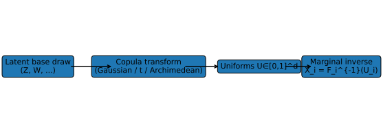
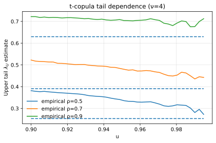

# 1. Simulation of Random Variates from Copulas

## 1.1 Context and Motivation

Simulation is a fundamental tool in dependence modeling.  
Once a copula $C_\theta$ has been fitted, one often needs to generate
**synthetic samples** $(U_1,\ldots,U_d)\sim C_\theta$ to perform
backtesting, risk aggregation, or scenario analysis.

Simulating from a copula separates the **dependence generation**
(from $C_\theta$) and the **marginal sampling** (from $F_i$).  
This separation allows precise control of dependence while preserving
any desired marginal shape, making copula-based simulation a cornerstone
of Monte Carlo frameworks in finance, insurance, and engineering.

*This chapter introduces the simulation mechanisms that underpin all
diagnostic and calibration experiments in Copula Lab.*

---

## 1.2 Mathematical Definition

Given a copula $C_\theta$ on $[0,1]^d$, we aim to sample
$U=(U_1,\ldots,U_d)\sim C_\theta$.

The general principle:

1. Generate independent latent variables $Z$ from an appropriate base
   distribution.
2. Apply the **copula transformation** to obtain dependent uniforms.

The transformation depends on the copula family:

| Family | Simulation approach | Base randoms |
|---------|---------------------|---------------|
| **Gaussian** | $U=\Phi(Z)$ with $Z\sim \mathcal{N}(0,\Sigma_\theta)$ | Multivariate normal |
| **Student-t** | $U=t_\nu(Z)$ with $Z\sim t_\nu(0,\Sigma_\theta)$ | Multivariate t |
| **Clayton** | $U_i=(1+W/E_i)^{-1/\theta}$, $W\sim\text{Gamma}(1/\theta,1)$ | Gamma + exponential |
| **Gumbel** | $U_i=\exp[-W_i/S^{1/\theta}]$, $W_i\sim\text{Exp}(1)$ | Stable + exponential |
| **Frank** | $U_i=-\frac{1}{\theta}\log\!\big(1+e^{-\theta V_i}(e^{-\theta W}-1)\big)$ | Uniform + exponential |
| **Joe / BB families** | Use Archimedean generator inversion | Gamma / stable mixtures |

In the **Archimedean case**, simulation exploits the representation

$$
C_\theta(u_1,\ldots,u_d)
 = \psi_\theta\!\left(
   \psi_\theta^{-1}(u_1) + \cdots + \psi_\theta^{-1}(u_d)
 \right),
$$

where $\psi_\theta$ is the generator and $\psi_\theta^{-1}$ its inverse.  
The stochastic representation is:

$$
U_i = \psi_\theta(E_i / S), \quad
S \sim f_S(s),\ E_i\sim \text{Exp}(1).
$$

The latent variable $S$ ensures the dependence between components.

---

## 1.3 Interpretation and Intuition

Simulating from copulas allows one to:

- **Replicate joint behavior** under controlled dependence.  
- **Stress-test** the impact of tail dependence and asymmetry.  
- **Benchmark** analytical or numerical calibration routines.  

The separation between marginal and copular layers makes it possible to
simulate from *heterogeneous marginal systems* while preserving the
same dependence structure — a key feature in credit, liquidity, or
market-risk models.

Intuitively, the generator or correlation matrix determines how uniform
marginals are “distorted” to create the target dependence pattern.

---

## 1.4 Properties and Remarks

| Property | Description | Implication |
|-----------|--------------|-------------|
| **Universality** | Any copula can be simulated via generator or conditional inversion | Fully general framework |
| **Dimension scalability** | Efficient for moderate $d$; costly for large $d$ if nested | Use parallelization |
| **Numerical accuracy** | Sensitive to random seed and numerical inversion | Use high-precision routines |
| **Archimedean trick** | Simulate latent $S$ variable → dependence via generator | Enables efficient sampling |
| **Elliptical trick** | Use linear correlation structure | Simple via Cholesky or PCA |
| **Tail behavior** | Preserved exactly if underlying family captures $\lambda_U,\lambda_L$ | Useful for stress testing |
| **Validation** | Compare empirical copula of simulated sample to $C_\theta$ | Ensures calibration fidelity |

### Pseudo-random uniformization

To recover the original data scale:

$$
X_i = F_i^{-1}(U_i),
$$

where $F_i^{-1}$ is the inverse marginal CDF.  
This final step reintroduces the real-world distribution of each factor.

---

## 1.5 Conditional and Advanced Sampling

Beyond unconditional sampling, one can generate **conditional samples**
from a copula by recursively applying the conditional distributions:

$$
U_i = C_{U_i|U_{1:i-1}}^{-1}(v_i \mid u_{1:i-1}), \quad v_i \sim U(0,1),
$$

which enables simulation in **vine** or **pair-copula constructions**.  
This technique is essential for high-dimensional dependence modeling.

---

## 1.6 Illustration

**Figure — Simulation pipeline overview**  

Stepwise simulation process: base latent draw → copula transform →
marginal inverse mapping.

**Figure — Sampled dependence structures**  

Simulated $(U_1,U_2)$ from different copula families show characteristic
patterns of dependence and tail behavior.

**Figure — Empirical vs theoretical tail dependence**  

Empirical tail dependence can be estimated as

$$
\hat{\lambda}_U = 2 - \frac{\log(2 - \hat{C}(u,u))}{\log(u)},\quad u\to1,
$$

confirming sampling correctness when matching theoretical values.

---

## 1.7 References

- Joe, H. (2014). *Dependence Modeling with Copulas.* CRC Press.  
- McNeil, A. J., Frey, R., & Embrechts, P. (2015).
  *Quantitative Risk Management.* Princeton University Press.  
- Hofert, M., Kojadinovic, I., Maechler, M., & Yan, J. (2018).
  *Elements of Copula Modeling with R.* Springer.  
- Nelsen, R. B. (2006). *An Introduction to Copulas* (2nd ed.). Springer.  
- Barbe, P., & Genest, C. (2004). *On the Generation of Exchangeable
  Random Variables via Copulas.* *Statistics & Probability Letters*, 66(4), 323–328.
