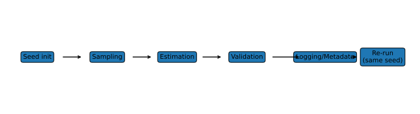

# 2. Reproducibility, Random Seeds, and Statistical Validation

## 2.1 Context and Motivation

In copula modeling — particularly in calibration, simulation, and
stress-testing — **reproducibility** is an essential scientific and
regulatory requirement.  
A model must yield identical results when executed under identical
inputs, software versions, and randomization states.

Reproducibility ensures:
- **Auditability:** regulators and peers can replicate published results.  
- **Stability:** model revisions can be compared under identical
  stochastic conditions.  
- **Traceability:** differences across runs can be attributed to code or
  data, not random noise.

In *Copula Lab*, reproducibility is treated as a first-class property of
every experiment, simulation, and calibration workflow.

---

## 2.2 Randomness and Control

Every copula-based simulation or estimation involves **stochastic
components**:

- Monte Carlo sampling from a theoretical copula $C_\theta$,
- Randomized optimization (stochastic gradients, restarts),
- Bootstrap resampling for goodness-of-fit tests.

Controlling these components requires **deterministic random seeds**
and **documented pseudorandom number generators (PRNGs)**.

A random seed defines the *initial state* of the generator and thus
fully determines the sequence of draws.  
Fixing the seed ensures that identical pseudorandom sequences are
reproduced across runs, independent of system architecture or hardware.

---

## 2.3 Reproducibility Protocol

A reproducible simulation in *Copula Lab* satisfies the following
principles:

1. **Fixed random seed per experiment**  
   Each experiment, notebook, or function sets a deterministic seed
   before any random operation. Seeds are stored in metadata.

2. **Single PRNG source**  
   All random draws (copula sampling, bootstrap, initialization) must
   derive from a unified PRNG (e.g., NumPy, PCG64, or system-level RNG).

3. **Seed propagation through modules**  
   The seed state is passed explicitly through simulation layers:
   - sampling of $(U_1,\ldots,U_d)$,
   - marginal inversion $F_i^{-1}$,
   - any random perturbation in calibration.

   *Example:*  
   A fixed seed initialized in the simulation layer is passed to the
   bootstrap module for resampling, and finally logged in the metadata
   of the resulting dataset.  
   This guarantees full traceability from sampling to validation.

4. **Metadata logging**  
   Every simulation records:
   - seed value,  
   - copula family and parameters,  
   - sample size,  
   - timestamp and environment details.

5. **Deterministic transformations only**  
   Post-processing (transformations, statistics, plots) must not involve
   additional random draws unless explicitly controlled.

6. **Environment control**  
   Reproducibility also requires:
   - fixed software versions (`requirements.txt`),  
   - documented Python version,  
   - deterministic BLAS/LAPACK threading behavior,  
   - platform-independent file paths.

---

## 2.4 Interpretation and Intuition

Reproducibility guarantees that **statistical conclusions are causal and
not artifacts of random sampling**.  
In copula-based analysis, the distinction between model uncertainty and
simulation noise is subtle but critical:

- **Model uncertainty** stems from data and parameter estimation.  
- **Simulation noise** stems from random number generation.

By fixing seeds and standardizing the environment, one can isolate model
uncertainty and obtain stable validation metrics across multiple runs.

Intuitively:
- Two analysts using the same copula parameters, dataset, and seed must
  obtain identical synthetic samples and identical derived statistics.  
- Changing the seed intentionally allows one to study stochastic
  variability (e.g., Monte Carlo standard errors).

---

## 2.5 Properties and Remarks

| Property | Description | Implication |
|-----------|--------------|-------------|
| **Determinism** | Same seed → identical output | Full reproducibility |
| **Transparency** | Seeds, PRNG, and software logged | Audit trail |
| **Comparability** | Different runs can be compared statistically | Enables sensitivity analysis |
| **Isolation** | Random noise separated from model behavior | Stable diagnostics |
| **Parallel reproducibility** | Requires coordinated seeding across processes | Controlled multi-core simulations |
| **Regulatory compliance** | Supports SR 11-7 / ECB TRIM reproducibility standards | Model validation ready |

---

## 2.6 Hierarchy of Reproducibility

1. **Computational reproducibility:**  
   identical random outputs given same environment.  
2. **Statistical reproducibility:**  
   identical parameter estimates given same data and method.  
3. **Scientific reproducibility:**  
   independent analysts replicate results using full documentation.

*Copula Lab* enforces the first two levels programmatically and the
third via documentation.

---

## 2.7 Statistical Validation Reproducibility

Reproducibility is not limited to code execution — it extends to the
statistical consistency of results. In *Copula Lab*, validation routines
incorporate reproducibility checks across stochastic runs:

| Diagnostic | Purpose | Typical reproducibility check |
|-------------|----------|-------------------------------|
| **Monte Carlo standard error** | Assess simulation stability | Variance across seeds |
| **Bootstrap GoF tests** | Evaluate goodness-of-fit robustness | Concordance of p-values |
| **Parameter estimation** | Ensure numerical stability | Cross-run correlation of $\hat\theta$ |
| **Tail dependence** | Check structural invariance | $\hat\lambda_{U,L}$ consistency across seeds |

These checks ensure that observed variability arises from **model
sensitivity**, not **implementation noise**.

---

## 2.8 Illustration

**Figure — Reproducibility pipeline**  

Seed initialization → Sampling → Estimation → Validation → Logging  
Each stage inherits the seed state to guarantee deterministic results.

---

## 2.9 References

- McNeil, A. J., Frey, R., & Embrechts, P. (2015).  
  *Quantitative Risk Management.* Princeton University Press.  
- Joe, H. (2014). *Dependence Modeling with Copulas.* CRC Press.  
- Gentle, J. E. (2003). *Random Number Generation and Monte Carlo Methods.* Springer.  
- Leisch, F. (2003). *Sweave and the Reproducible Statistical Report.*  
  *Computational Statistics*, 18(2), 167–178.  
- Peng, R. D. (2011). *Reproducible Research in Computational Science.*  
  *Science*, 334(6060), 1226–1227.
