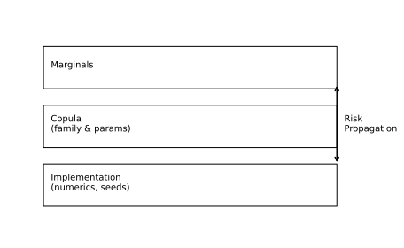
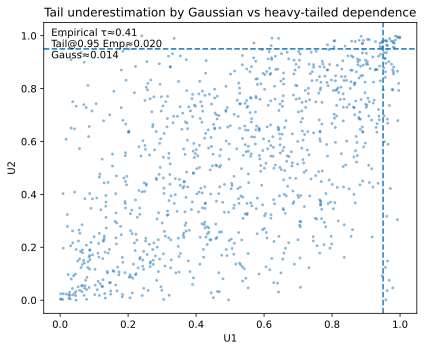

# 1. Model Risk and Practical Pitfalls in Copula Modeling

## 1.1 Context and Motivation
Copulas provide a flexible and elegant framework to model dependence,
but their misuse or misinterpretation can lead to severe **model risk**.
In quantitative finance, inappropriate assumptions about copula
structure or parameters have been linked to major pricing and risk
failures — most notably during the 2007–2008 financial crisis.

Understanding the **limitations, sensitivities, and failure modes** of
copula-based models is essential for credible and auditable
implementation.  
(See Section 2 for practical financial use-cases.)

---

## 1.2 Sources of Model Risk

### 1. Misspecification of the Copula Family
Choosing an incorrect copula family (e.g., Gaussian instead of Student-t)
leads to **systematic bias in tail dependence** and underestimation of
joint extreme events.

### 2. Marginal Misestimation
Copulas separate dependence from marginals, but if $F_i(x)$ are poorly
fitted, pseudo-observations $U_i=\hat F_i(X_i)$ distort the dependence
structure.  
Empirical marginals can mitigate this but may introduce discretization
bias.

### 3. Parameter Uncertainty
Even when the family is correct, the estimated $\hat\theta$ is subject to
sampling variability.  
Ignoring this uncertainty yields overly sharp joint predictions.

### 4. Dimensionality Effects
High-dimensional copulas (especially Archimedean) may lose flexibility
or violate theoretical constraints. Nested or vine constructions require
careful consistency checks.

### 5. Temporal Instability
Dependence parameters often evolve through time. Static copulas assume
stationarity, leading to poor backtesting performance in volatile
regimes.  
Dynamic copula models (e.g., time-varying parameter copulas, copula-GARCH,
DCC-copulas) can capture such non-stationarities and provide
more realistic regime-dependent dependence.

### 6. Data Contamination
Outliers, missing data, or asynchronous observations bias pseudo-
observations and therefore the inferred dependence.

---

## 1.3 Interpretation and Intuition

Model risk in copulas can be grouped into three dimensions:

| Dimension | Description | Typical Impact |
|------------|--------------|----------------|
| **Structural** | Wrong family or functional form | Systematic mispricing |
| **Parametric** | Estimation errors or sampling noise | Excess confidence |
| **Implementation** | Numerical errors, incorrect inversion, seed drift | Non-replicable outputs |

These dimensions interact: a small structural bias may amplify
parametric errors, producing unstable sensitivity to calibration
choices.

---

## 1.4 Diagnostic and Mitigation Strategies

The following table summarizes common sources of model risk and
corresponding diagnostic and mitigation practices.

| Risk Source | Diagnostic | Mitigation |
|--------------|-------------|-------------|
| Family misspecification | Compare GoF (KS, CvM) and tail metrics | Use model selection or mixture copulas |
| Marginal errors | PIT histograms, QQ-plots | Use semiparametric marginals |
| Parameter uncertainty | Bootstrap confidence intervals | Report parameter dispersion |
| Dimensional limits | Check nested consistency | Use vine or factor copulas |
| Temporal drift | Rolling window calibration | Implement dynamic copulas |
| Data issues | Residual plots, leverage diagnostics | Robust preprocessing |

Mitigation must balance parsimony and robustness: more complex copulas
are not necessarily safer if their calibration cannot be validated.

---

## 1.5 Illustration

**Figure — Propagation of model risk through copula layers**  

Diagram showing how marginal, copular, and implementation uncertainties
compound into overall risk of dependence misrepresentation.

**Figure — Tail underestimation due to misspecified copula**  

Comparison of Gaussian and Student-t copulas fitted to the same data:
the Gaussian model fails to capture co-extremes.

---

## 1.6 References

- Embrechts, P., McNeil, A. J., & Straumann, D. (2002).
  *Correlation and Dependence in Risk Management: Properties and Pitfalls.*
  In *Risk Management: Value at Risk and Beyond*, Cambridge Univ. Press.  
- Joe, H. (2014). *Dependence Modeling with Copulas.* CRC Press.  
- McNeil, A. J., Frey, R., & Embrechts, P. (2015).
  *Quantitative Risk Management.* Princeton University Press.  
- Nelsen, R. B. (2006). *An Introduction to Copulas.* Springer.  
- Danielsson, J. (2011). *Financial Risk Forecasting.* Wiley Finance.

---

## 1.7 Key Takeaways
- Mis-specified copulas can severely distort tail dependence and systemic risk measures.  
- Parameter and marginal uncertainties propagate multiplicatively, amplifying model instability.  
- Robust calibration, stress testing, and transparency in assumptions are the primary defenses against model risk.
