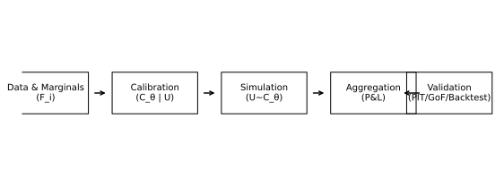
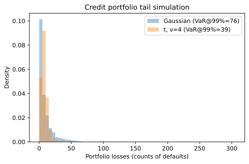
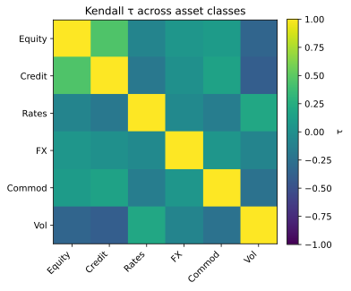

# 2. Financial and Risk Management Applications of Copulas

## 2.1 Context and Motivation
Copula models provide a rigorous and flexible framework for describing
dependence beyond linear correlation.  
In finance, they enable joint modeling of assets, portfolios, and risk
factors when relationships are nonlinear, asymmetric, or dominated by
extremes.

Their modular design—separating marginals and dependence—makes them
ideal for integrating heterogeneous data sources (credit, market,
liquidity, macro).  
This section summarizes key **use cases and methodological frameworks**
where copulas are used in risk, valuation, and stress testing.

---

## 2.2 Portfolio Risk Aggregation

### Motivation
Portfolio-level loss and profit depend on the joint distribution of
individual components.  
Assuming multivariate normality leads to severe underestimation of joint
extremes; copulas solve this by allowing non-Gaussian tail structures.

### Implementation
1. Estimate marginals of asset or factor returns ($F_i$).  
2. Fit copula $C_\theta$ to standardized residuals.  
3. Simulate joint scenarios $(U_1,\ldots,U_d)\sim C_\theta$.  
4. Rebuild portfolio P&L distribution from marginal inverses.

### Outputs
- Portfolio VaR and ES under nonlinear dependence.  
- Tail contribution analysis (which factors co-move in stress).  
- Validation against empirical P&L and backtesting series.

**Applications:** trading book aggregation (FRTB), ALM liquidity risk,
credit-economic capital.

---

## 2.3 Credit Portfolio Models

### Motivation
Credit defaults are binary events with asymmetric joint behavior:
systemic downturns increase simultaneous defaults.  
Copulas provide a consistent way to model this **default correlation**
separately from marginal default probabilities.

### Implementation
Latent-variable structure:

$$
Z_i = \sqrt{\rho}\,Y + \sqrt{1-\rho}\,\varepsilon_i,
$$

with $Y,\varepsilon_i$ i.i.d. and
$(Y,\varepsilon_i)$ linked via a copula $C_\theta$.

Default occurs when $Z_i$ falls below a threshold linked to PD$_i$.
This framework generalizes the **Gaussian Copula** of Li (2000) to
Student-t, Clayton, or mixture copulas for tail dependence.

### Outputs
- Portfolio loss distribution and joint default probability.  
- Systematic vs. idiosyncratic correlation decomposition.  
- Credit VaR, IRC, and DRC-SA calculations under stress.

---

## 2.4 Dependence in Market Factors

Copulas allow modeling **cross-asset or cross-market dependencies**
without assuming linear correlation stability.

**Examples:**
- Equity–volatility or credit–spread co-movements (t- or Gumbel copula).  
- FX triangles and carry trades (Frank or t copulas).  
- Commodity price hierarchies (vine copulas capturing sectoral shocks).

Outputs include dynamic correlations, co-stress maps, and simulation of
multi-factor shocks for scenario generators.

Dynamic or regime-switching copulas are especially useful to model
volatility clustering and contagion effects during market stress.

---

## 2.5 Structured Products and Derivatives Pricing

### Use Case
Structured instruments (CDOs, basket options, hybrid swaps) depend on
the joint distribution of underlying assets.  
Copula-based models price these products by integrating dependence
between component payoffs.

### Typical Frameworks
| Product | Copula Usage | Key Objective |
|----------|---------------|----------------|
| **CDO tranches** | Gaussian / t copula of default times | Loss correlation across tranches |
| **Basket options** | Gaussian / Clayton copula of returns | Nonlinear joint payoff valuation |
| **Hybrid instruments** | Vine or t copula between rates, spreads, FX | Joint stress modeling |

Typical outputs include expected tranche loss, implied correlation
curves, and basket option Greeks under non-Gaussian dependence.

---

## 2.6 Stress Testing and Scenario Generation

Copulas provide a systematic way to design **consistent stress
scenarios** across correlated factors.  
Instead of shocking variables independently, the dependence structure
ensures realistic joint outcomes.

- **Top-down approach:** simulate $(U_1,\ldots,U_d)\sim C_\theta$ and
  apply marginal quantile shocks.  
- **Bottom-up approach:** impose tail co-movement through fitted
  $\lambda_U$, $\lambda_L$ parameters.

Use in:
- macroprudential stress testing (ECB, BoE frameworks),
- internal ICAAP/ILAAP simulations,
- joint liquidity and credit stress propagation.

---

## 2.7 Practical Considerations and Limitations

| Aspect | Challenge | Best Practice |
|--------|------------|---------------|
| **Tail calibration** | Few observations in extremes | Use t or Archimedean copulas with λ>0 |
| **Parameter instability** | Dependence shifts over regimes | Apply rolling or regime-switching copulas |
| **Dimensionality** | Curse of dimensionality | Use vines or factor copulas |
| **Interpretability** | Nonlinear correlation hard to explain | Report τ, ρ, λ summaries |
| **Computation** | Heavy optimization for large d | Pre-calibrate in sub-blocks |

---

## 2.8 Illustration

**Figure — Copula-based risk aggregation pipeline**  

End-to-end process: calibration, copula simulation, risk aggregation,
validation.

**Figure — Credit portfolio tail simulation**  

Comparison of Gaussian vs. t copula tail losses for a synthetic credit
portfolio.

**Figure — Dependence heatmap across asset classes**  

Empirical τ and λ coefficients between major asset classes illustrating
regime-dependent co-movement.

---

## 2.9 Validation and Goodness-of-Fit
In all applications, copula adequacy should be verified through
systematic validation procedures:
- Probability Integral Transform (PIT) histograms,
- KS and CvM goodness-of-fit statistics,
- Tail-dependence diagnostics ($\lambda_L$, $\lambda_U$),
- Backtesting of simulated joint distributions versus empirical series.

---

## 2.10 Integration with Regulatory Frameworks
Copula-based aggregation frameworks are increasingly recognized in
supervisory contexts, particularly for **FRTB internal models**, **credit
concentration risk**, and **stress testing** under **Basel III/IV**
principles.  
Regulators emphasize:
- Transparent documentation of dependence assumptions;  
- Independent challenge of copula family and parameter choices;  
- Demonstrable stability of outputs under stress and parameter
perturbation.

---

## 2.11 References

- Li, D. X. (2000). *On Default Correlation: A Copula Function Approach.*
  *Journal of Fixed Income*, 9(4), 43–54.  
- McNeil, A. J., Frey, R., & Embrechts, P. (2015).
  *Quantitative Risk Management.* Princeton University Press.  
- Embrechts, P., Lindskog, F., & McNeil, A. (2003).
  *Modelling Dependence with Copulas and Applications to Risk Management.*
  In *Handbook of Heavy Tailed Distributions in Finance.*  
- Joe, H. (2014). *Dependence Modeling with Copulas.* CRC Press.  
- Rosenberg, J. V., & Schuermann, T. (2006).
  *A General Approach to Integrated Risk Management with Skewed,
  Fat-tailed Risks.*  
  *Journal of Financial Economics*, 79(3), 569–614.
